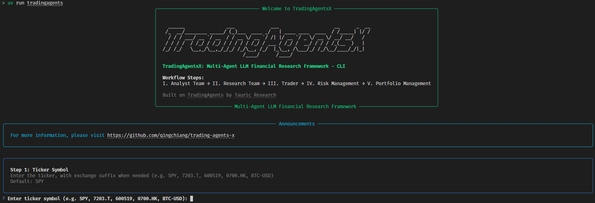

# trading-agents-x

<div align="center" style="line-height: 1;">
  <a href="https://arxiv.org/abs/2412.20138" target="_blank"></a>
  
</div>

A multi-agent LLM trading framework with first-class **Japanese-market (`.T`) data support** — J-Quants, EDINET, TDnet, and multi-region macro (FRED / e-Stat / BOJ) vendors wired through a generic suffix-based market-routing layer.

> **Fork notice.** This is an independently maintained fork of [TauricResearch/TradingAgents](https://github.com/TauricResearch/TradingAgents) (Apache-2.0). It adds Japanese-market data vendors and market-aware routing on top of the upstream framework and does not track upstream releases one-to-one. For upstream release news and community, see the [upstream repository](https://github.com/TauricResearch/TradingAgents). Original attribution and license are retained — see [LICENSE](LICENSE) and [NOTICE](NOTICE).

<div align="center">

🚀 [Framework](#tradingagents-framework) | ⚡ [Installation & CLI](#installation-and-cli) | 🇯🇵 [Japanese Market](#japanese-market-support-this-fork) | 📦 [Package Usage](#tradingagents-package) | 📄 [Citation](#citation)

</div>

## TradingAgents Framework

TradingAgents is a multi-agent trading framework that mirrors the dynamics of real-world trading firms. By deploying specialized LLM-powered agents: from fundamental analysts, sentiment experts, and technical analysts, to trader, risk management team, the platform collaboratively evaluates market conditions and informs trading decisions. Moreover, these agents engage in dynamic discussions to pinpoint the optimal strategy.

<p align="center">
  
</p>

> TradingAgents framework is designed for research purposes. Trading performance may vary based on many factors, including the chosen backbone language models, model temperature, trading periods, the quality of data, and other non-deterministic factors. [It is not intended as financial, investment, or trading advice.](https://tauric.ai/disclaimer/)

Our framework decomposes complex trading tasks into specialized roles.

### Analyst Team
- Fundamentals Analyst: Evaluates company financials and performance metrics, identifying intrinsic values and potential red flags.
- Sentiment Analyst: Aggregates news headlines, StockTwits, and Reddit chatter into a single sentiment read to gauge short-term market mood.
- News Analyst: Monitors global news and macroeconomic indicators, interpreting the impact of events on market conditions.
- Technical Analyst: Utilizes technical indicators (like MACD and RSI) to detect trading patterns and forecast price movements.

<p align="center">
  
</p>

### Researcher Team
- Comprises both bullish and bearish researchers who critically assess the insights provided by the Analyst Team. Through structured debates, they balance potential gains against inherent risks.

<p align="center">
  
</p>

### Trader Agent
- Composes reports from the analysts and researchers to make informed trading decisions, determining the timing and magnitude of trades.

<p align="center">
  
</p>

### Risk Management and Portfolio Manager
- Continuously evaluates portfolio risk by assessing market volatility, liquidity, and other risk factors. The risk management team evaluates and adjusts trading strategies, providing assessment reports to the Portfolio Manager for final decision.
- The Portfolio Manager approves/rejects the transaction proposal. If approved, the order will be sent to the simulated exchange and executed.

<p align="center">
  
</p>

## Installation and CLI

### Installation

Clone the repository:
```bash
git clone https://github.com/qingchiang/trading-agents-x.git
cd trading-agents-x
```

Create a virtual environment in any of your favorite environment managers:
```bash
conda create -n tradingagents python=3.12
conda activate tradingagents
```

Install the package and its dependencies:
```bash
pip install .
```

### Docker

Alternatively, run with Docker:
```bash
cp .env.example .env  # add your API keys
docker compose run --rm tradingagents
```

For local models with Ollama:
```bash
docker compose --profile ollama run --rm tradingagents-ollama
```

### Required APIs

TradingAgents supports multiple LLM providers. Set the API key for your chosen provider:

```bash
export OPENAI_API_KEY=...          # OpenAI (GPT)
export GOOGLE_API_KEY=...          # Google (Gemini)
export ANTHROPIC_API_KEY=...       # Anthropic (Claude)
export XAI_API_KEY=...             # xAI (Grok)
export DEEPSEEK_API_KEY=...        # DeepSeek
export DASHSCOPE_API_KEY=...       # Qwen — International (dashscope-intl.aliyuncs.com)
export DASHSCOPE_CN_API_KEY=...    # Qwen — China (dashscope.aliyuncs.com)
export ZHIPU_API_KEY=...           # GLM via Z.AI (international)
export ZHIPU_CN_API_KEY=...        # GLM via BigModel (China, open.bigmodel.cn)
export MINIMAX_API_KEY=...         # MiniMax — Global (api.minimax.io)
export MINIMAX_CN_API_KEY=...      # MiniMax — China (api.minimaxi.com)
export OPENROUTER_API_KEY=...      # OpenRouter
export ALPHA_VANTAGE_API_KEY=...   # Alpha Vantage
```

Japanese-market (`.T`) data uses its own keys (J-Quants, EDINET, e-Stat) — see [Japanese Market Support](#japanese-market-support-this-fork) below. All are optional; without them `.T` tickers fall back to yfinance.

For Azure OpenAI, copy `.env.enterprise.example` to `.env.enterprise` and fill in your credentials.

For AWS Bedrock, install the extra with `pip install ".[bedrock]"`, set `llm_provider: "bedrock"`, configure AWS credentials (environment variables, `~/.aws/credentials`, or an IAM role) and `AWS_DEFAULT_REGION`, and use a Bedrock model ID, e.g. `us.anthropic.claude-opus-4-8-v1:0`.

For local models, configure Ollama with `llm_provider: "ollama"`. The default endpoint is `http://localhost:11434/v1`; set `OLLAMA_BASE_URL` to point at a remote `ollama-serve`. Pull models with `ollama pull <name>`, and pick "Custom model ID" in the CLI for any model not listed by default.

For any other OpenAI-compatible server (vLLM, LM Studio, llama.cpp, or a custom relay), use `llm_provider: "openai_compatible"` and set the endpoint via `backend_url` (or `TRADINGAGENTS_LLM_BACKEND_URL`), e.g. `http://localhost:8000/v1` for vLLM or `http://localhost:1234/v1` for LM Studio. The model is whatever your server serves. No key is needed for local servers; set `OPENAI_COMPATIBLE_API_KEY` when the endpoint requires one.

Alternatively, copy `.env.example` to `.env` and fill in your keys:
```bash
cp .env.example .env
```

### CLI Usage

Launch the interactive CLI:
```bash
tradingagents          # installed command
python -m cli.main     # alternative: run directly from source
```
You will see a screen where you can select your desired tickers, analysis date, LLM provider, research depth, and more.

### Markets and tickers

TradingAgents works with any market Yahoo Finance covers, using the exchange-suffixed ticker. Company identity and the alpha benchmark resolve automatically per market.

- US: `AAPL`, `SPY`
- Hong Kong: `0700.HK` · Tokyo: `7203.T` · London: `AZN.L`
- India: `RELIANCE.NS`, `.BO` · Canada: `.TO` · Australia: `.AX`
- China A-shares: Shanghai `.SS`, Shenzhen `.SZ` (e.g. `600519.SS` for Kweichow Moutai)
- Crypto: `BTC-USD`, `ETH-USD`

<p align="center">
  
</p>

An interface will appear showing results as they load, letting you track the agent's progress as it runs.

<p align="center">
  
</p>

<p align="center">
  
</p>

## Japanese Market Support (this fork)

Yahoo Finance covers `.T` tickers only thinly (adjusted OHLC, sparse fundamentals, English-only news). This fork routes Tokyo tickers to **native Japanese data sources** across all four analysts, wired through the generic suffix-based routing layer:

| Analyst | Source | What it adds over the Yahoo baseline |
|---|---|---|
| Market / technicals | **J-Quants** `/equities/bars/daily` | Official TSE prices, indicators, and vendor-routed verified snapshots with explicit source labels |
| Fundamentals | **J-Quants** `/fins/summary` + assemblers | Disclosure-date-safe ratios, deduplicated/accounting-labelled summaries, and live-only curated statement detail |
| News | **EDINET** + **TDnet 適時開示** + **Google News (ja)** + **J-Quants** section flows | Statutory filings, timely disclosures, Japanese-language media, and clearly labelled Prime/Standard/Growth market context that is never attributed to the ticker |
| Sentiment | **J-Quants** per-stock margin / short-sale + **EDINET** 大量保有 & 公開買付 (TOB) | Per-company positioning and filings in place of US-retail social feeds; exchange-wide investor flows are intentionally excluded |
| Macro | **FRED** + **e-Stat** + **BOJ** | Cross-region backdrop (JP equities move on the Fed, China, and the BOJ), disk-cached across runs |

**Configuration.** Add the free keys to `.env` (see `.env.example`):

```bash
export JQUANTS_API_KEY=...   # J-Quants v2 — prices, fundamentals, sentiment signals (https://jpx-jquants.com/)
export EDINET_API_KEY=...    # EDINET — statutory disclosures + large-shareholding / TOB (https://api.edinet-fsa.go.jp/)
export ESTAT_APP_ID=...      # e-Stat — Japanese CPI for the macro panel (https://www.e-stat.go.jp/api/)
export FRED_API_KEY=...      # FRED — US/global macro (https://fred.stlouisfed.org/docs/api/api_key.html)
```

J-Quants plan tiers: the **Light** plan covers prices, `/fins/summary`, and exchange-section investor flows — enough for market, fundamentals, and News regional context. The **Standard** plan additionally unlocks the per-ticker margin-balance and short-position sentiment signals. The **Premium** plan is *not* required (line-item `/fins/details` is intentionally unused).

**Graceful fallback — nothing is mandatory.** The JP vendors are *additive*: each degrades to the configured fallback rather than crashing.
- No `JQUANTS_API_KEY` → prices and near-live fundamentals can fall back to **yfinance** (Yahoo data, English); historical `.T` statements fail closed because Yahoo does not expose filing timestamps.
- No `EDINET_API_KEY` → the news assembler drops the filings segment but still returns Google-News media (which needs no key); if every source is empty it falls back to yfinance.
- On the **Light** plan → the Standard-only margin/short signals are simply omitted; the remaining sentiment signals still populate.
- Missing macro keys → the macro panel degrades to a sentinel (macro is an optional category), never blocking a run.

**What this fork optimizes.**
- **Historical runs fail closed for live-only data.** JP official sources remain look-ahead-safe, and historical runs do not query current StockTwits, Reddit, yfinance `.info`, or yfinance `.T` statement frames without filing timestamps. Fundamentals graph tools inject the analysis date from workflow state, so the LLM cannot omit or override it; direct statement calls that omit it retain live-retrieval compatibility and are labelled as such. Near-live social messages are filtered to the requested market-calendar date window.
- **More accurate data.** Official J-Quants prices and `/fins/summary` fundamentals replace Yahoo's thin `.T` coverage; the fundamentals assembler computes valuation ratios and a TOPIX-weekly beta on a proper Japanese benchmark, deduplicates repeated period disclosures, and labels IFRS/GAAP scope explicitly.
- **Signal, not noise.** Yahoo ticker news and Google News JP use a configurable 14-day company-news window and a hybrid evidence boundary: explicit ticker/full-name evidence is `[direct]`, ambiguous names/tickers and summary-only mentions are `[candidate]` for the analyst to verify, and `[context]` remains external background. Dates, duplicates, known template/disclosure mirrors, blocked junk sources, and items with no entity evidence are handled deterministically. Fast-decaying StockTwits/Reddit sentiment and global macro news default to 7 days; if the social window is widened, Reddit selects an encompassing search bucket before exact calendar filtering. Sentiment uses official positioning data instead of scrape-only, ToS-grey retail boards.
- **Point-in-time-safe identity.** Live analysis can use rich yfinance `.info` identity fields. Historical graph startup and news alias resolution use exact-symbol `yf.Search` metadata instead, so current sector/industry cannot leak into a backtest.

See [CLAUDE.md](CLAUDE.md) for the full vendor architecture.

## TradingAgents Package

### Implementation Details

We built TradingAgents with LangGraph to ensure flexibility and modularity. The framework supports multiple LLM providers: OpenAI, Google, Anthropic, xAI, DeepSeek, Qwen (Alibaba DashScope, international and China endpoints), GLM (Zhipu), MiniMax (global + China), OpenRouter, Ollama for local models, and Azure OpenAI for enterprise.

### Python Usage

To use TradingAgents inside your code, you can import the `tradingagents` module and initialize a `TradingAgentsGraph()` object. The `.propagate()` function will return a decision. You can run `main.py`, here's also a quick example:

```python
from tradingagents.graph.trading_graph import TradingAgentsGraph
from tradingagents.default_config import DEFAULT_CONFIG

ta = TradingAgentsGraph(debug=True, config=DEFAULT_CONFIG.copy())

# forward propagate
_, decision = ta.propagate("NVDA", "2026-01-15")
print(decision)
```

You can also adjust the default configuration to set your own choice of LLMs, debate rounds, etc.

```python
from tradingagents.graph.trading_graph import TradingAgentsGraph
from tradingagents.default_config import DEFAULT_CONFIG

config = DEFAULT_CONFIG.copy()
config["llm_provider"] = "openai"        # e.g. openai, google, anthropic, deepseek, groq, ollama; openai_compatible covers any OpenAI-compatible endpoint (vLLM, LM Studio, llama.cpp, ...)
config["deep_think_llm"] = "gpt-5.5"     # Model for complex reasoning
config["quick_think_llm"] = "gpt-5.4-mini" # Model for quick tasks
config["quick_reasoning_effort"] = "low"
config["deep_reasoning_effort"] = "high"
config["max_debate_rounds"] = 2

ta = TradingAgentsGraph(debug=True, config=config)
_, decision = ta.propagate("NVDA", "2026-01-15")
print(decision)
```

See `tradingagents/default_config.py` for all configuration options.

### Reasoning effort by role

The `quick_reasoning_effort` and `deep_reasoning_effort` config keys shown above
control reasoning depth independently for the two roles. For CLI or unattended
runs, set their environment-variable equivalents in `.env`:

```dotenv
TRADINGAGENTS_QUICK_REASONING_EFFORT=low
TRADINGAGENTS_DEEP_REASONING_EFFORT=high
```

Each role uses this precedence: role-specific value, then the selected
provider's legacy shared key (`TRADINGAGENTS_OPENAI_REASONING_EFFORT`,
`TRADINGAGENTS_GOOGLE_THINKING_LEVEL`, or `TRADINGAGENTS_ANTHROPIC_EFFORT`),
then the provider default. Use `provider_default` to explicitly omit the native
SDK parameter and block legacy fallback. Values are provider-native and are not
translated between providers. OpenAI/OpenAI-compatible/Azure and DeepSeek send
`reasoning_effort`, Google sends `thinking_level`, and Anthropic sends `effort`.

DeepSeek V4 accepts the effective levels `high` and `max`. Thinking mode is
enabled by default for V4; these role settings control its effort only and do
not toggle thinking mode. The non-thinking alias `deepseek-chat`, scheduled for
deprecation on 2026-07-24, does not receive `reasoning_effort`.

The OpenAI CLI catalog includes GPT-5.6 Luna and Terra for quick work and
GPT-5.6 Sol and Terra for deep work. `gpt-5.6` aliases Sol; the four GPT-5.6 IDs
support `none`, `low`, `medium`, `high`, `xhigh`, and `max`. The default models
remain `gpt-5.4-mini` and `gpt-5.5`.

## Persistence and Recovery

TradingAgents persists two kinds of state across runs.

### Decision log

The decision log is always on. Each completed run appends its decision to `~/.tradingagents/memory/trading_memory.md`. On the next run for the same ticker, TradingAgents fetches the realised return (raw and alpha vs the ticker's market benchmark — SPY for US, the Nikkei 225 for `.T`, resolved per market via `benchmark_map`), generates a one-paragraph reflection, and injects the most recent same-ticker decisions plus recent cross-ticker lessons into the Portfolio Manager prompt, so each analysis carries forward what worked and what didn't.

Override the path with `TRADINGAGENTS_MEMORY_LOG_PATH`.

### Checkpoint resume

Checkpoint resume is opt-in via `--checkpoint`. When enabled, LangGraph saves state after each node so a crashed or interrupted run resumes from the last successful step instead of starting over. On a resume run you will see `Resuming from step N for <TICKER> on <date>` in the logs; on a new run you will see `Starting fresh`. Checkpoints are cleared automatically on successful completion.

Per-ticker SQLite databases live at `~/.tradingagents/cache/checkpoints/<TICKER>.db` (override the base with `TRADINGAGENTS_CACHE_DIR`). Use `--clear-checkpoints` to reset all of them before a run.

```bash
tradingagents analyze --checkpoint           # enable for this run
tradingagents analyze --clear-checkpoints    # reset before running
```

```python
config = DEFAULT_CONFIG.copy()
config["checkpoint_enabled"] = True
ta = TradingAgentsGraph(config=config)
_, decision = ta.propagate("NVDA", "2026-01-15")
```

## Reproducibility

TradingAgents is LLM-driven, so two runs of the same ticker and date can differ. This is expected for a research tool built on language models, not a defect. The variation comes from a few distinct sources, and it helps to separate them.

Language model sampling is non-deterministic. Even at a fixed temperature, providers do not guarantee byte-identical output across calls, and reasoning models (the default GPT-5.x family, and any thinking-mode model) vary the most because their internal reasoning is itself sampled.

Live data moves. News and other live feeds can return different content as time passes. For historical trade dates the framework now skips StockTwits, Reddit, and yfinance `.info` instead of injecting current data. For dates inside the five-day live window, social messages are filtered to the requested start/end dates, though the public feed sample itself can still change between retrievals.

To reduce variation you can lower the sampling temperature. Set `temperature` in your config (or `TRADINGAGENTS_TEMPERATURE` in `.env`); lower values make models that honor it more repeatable. The current curated models are reasoning-first and largely ignore temperature, so for tighter reproducibility use a non-reasoning model, which you can set explicitly via the Custom model ID option.

```python
config = DEFAULT_CONFIG.copy()
config["llm_provider"] = "openai"
config["temperature"] = 0.0
# Reasoning models ignore temperature. For tighter reproducibility, set a
# non-reasoning deep/quick model explicitly (e.g. via the Custom model ID option).
```

What does not vary anymore: the analyzed company identity is resolved deterministically from the ticker before any agent runs, and the market analyst grounds exact price and indicator claims in a verified data snapshot routed through the configured technical vendor chain. The snapshot always labels the actual source, including fallback.

Backtest results are not guaranteed to match any published figure. Returns depend on the model, the temperature, the date range, data quality, and the sampling above. Treat the framework as a research scaffold for studying multi-agent analysis, not as a strategy with a fixed, replicable return.

## Contributing

Contributions are welcome: bug fixes, documentation, and feature ideas; past contributions are credited per release in [`CHANGELOG.md`](CHANGELOG.md).

### Testing

The default test suite disables project dotenv loading and replaces API
credentials with placeholders before test modules are collected. It never runs
live LLM calls.

```bash
PYTHON_DOTENV_DISABLED=1 uv run --extra dev pytest -q
PYTHON_DOTENV_DISABLED=1 uv run --extra dev ruff check .
```

The DeepSeek wire-level integration test is opt-in. It runs only when both the
flag and key are explicitly supplied by the launching shell or secret manager:

```bash
RUN_LIVE_LLM_TESTS=1 DEEPSEEK_API_KEY=... \
  uv run --extra dev pytest -q tests/test_deepseek_reasoning.py -m integration
```

## Citation

Please reference our work if you find *TradingAgents* provides you with some help :)

```
@misc{xiao2025tradingagentsmultiagentsllmfinancial,
      title={TradingAgents: Multi-Agents LLM Financial Trading Framework}, 
      author={Yijia Xiao and Edward Sun and Di Luo and Wei Wang},
      year={2025},
      eprint={2412.20138},
      archivePrefix={arXiv},
      primaryClass={q-fin.TR},
      url={https://arxiv.org/abs/2412.20138}, 
}
```
