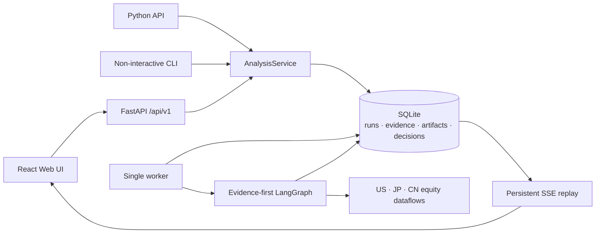

# TradingAgentsX

<div align="center">

**English** · [简体中文](docs/i18n/README.zh-CN.md) ·
[日本語](docs/i18n/README.ja.md)

</div>

<div align="center">
  <a href="https://arxiv.org/abs/2412.20138"></a>
  
</div>

TradingAgentsX is a local, single-user investment-research run center. It
combines a React Web UI, a versioned FastAPI service, a durable SQLite queue,
and an evidence-first LangGraph workflow for US, Japanese, and mainland-China
listed equities. Internally, these equities use canonical Yahoo-style
Instrument Keys; broader vendor symbol support does not expand the product
candidate boundary.

The system produces research conclusions, not account instructions. Its typed
decision contains a rating, confidence, thesis, evidence references, catalysts,
risks, invalidation conditions, and time horizon. It deliberately does not
produce position sizing, account allocation, entries, stops, targets, orders,
or portfolio rebalancing.

> **Independent product line.** TradingAgentsX preserves the Git history,
> Apache-2.0 attribution, and paper citation inherited from
> [TauricResearch/TradingAgents](https://github.com/TauricResearch/TradingAgents),
> but no longer merges upstream as a development strategy. Upstream is monitored
> read-only; relevant security or correctness fixes are independently audited
> and selectively reimplemented or cherry-picked. See
> [ADR 0001](docs/adr/0001-independent-product-line.md).

> TradingAgentsX is a research tool, not financial or investment advice. Model
> output can be wrong, and data can be incomplete, stale, or unavailable.

## Product surface

- **Dashboard:** queued and recent runs with ticker display names and statuses.
- **New Run:** instrument, market-local analysis date, analysts, profile,
  provider/models, reasoning effort, report language, and recent-instrument
  suggestions.
- **Runs:** active/trash filters, search, pagination, and recoverable batch
  trash management.
- **Run Detail:** persistent event timeline, analyst reports, structured
  decision, collapsible audit details, token/tool metrics, cancellation,
  retry, restore, editable run templates, and export.
- **Settings:** read-only capabilities, safe defaults, and whether provider
  credentials are configured.
- **Locales:** `en`, `zh-CN`, and `ja`; UI locale and report output language
  are independent.

New Run lists only configured providers and discovers their current model
catalog on demand. If discovery is unavailable, configured defaults and an
independent custom model ID for each role remain usable.

Provider availability is not an end-to-end reliability guarantee. DeepSeek V4
Flash is the currently validated Research Graph configuration; native OpenAI,
Anthropic, Google, and Azure integrations are preview-level, while other
OpenAI-compatible, local, and Bedrock adapters are compatibility-level. See
[LLM provider support levels](docs/provider-support.md) for the exact scope and
qualification policy.

Markdown is rendered without raw HTML and sanitized before display.

## Quick start

Python 3.12–3.14 and uv 0.12.1 or newer are supported. Node.js is needed only
when developing the frontend; release wheels already include the compiled Web
assets.

```bash
curl -LsSf https://astral.sh/uv/install.sh | sh
git clone https://github.com/qingchiang/trading-agents-x.git
cd trading-agents-x
uv sync --locked --no-dev
cp .env.example .env
```

Configure one LLM provider in `.env`, then start the local Web and worker
together:

```bash
uv run --locked --no-dev tradingagents start
```

The command keeps both child processes separate, prefixes their merged output
with colored `[web]` and `[worker]` labels, and respects `NO_COLOR`. The first
Ctrl+C requests a cooperative shutdown; press it again, or wait 30 seconds, to
force remaining children to stop. An interrupted analysis is resumed from its
checkpoint on the next worker. Use `--log-dir PATH` only when rotating on-disk
logs are wanted. The underlying commands remain available for independent
process management:

```bash
uv run --locked --no-dev tradingagents serve
uv run --locked --no-dev tradingagents worker
```

Open <http://127.0.0.1:8000>. The Web process accepts and displays work; the
single-concurrency worker claims queued runs and records execution history.

For one synchronous run without the Web UI:

```bash
uv run --locked --no-dev tradingagents run 7203.T \
  --date 2026-07-24 \
  --profile standard \
  --output-language ja
```

### Docker Compose

```bash
cp .env.example .env
docker compose up --build
```

Compose runs `web` and `worker` against one named volume. Port 8000 is published
to `127.0.0.1` by default. To use the optional Ollama service, set
`TRADINGAGENTS_LLM_PROVIDER=ollama` and
`OLLAMA_BASE_URL=http://ollama:11434/v1` in `.env`, then run:

```bash
docker compose --profile ollama up --build
```

SQLite must remain on a local filesystem shared by the Web and worker processes
on the same host. Do not place its WAL files on NFS, SMB, or another network
filesystem.

## Research profiles

Every profile uses one sealed, versioned `EvidenceBundle` and the same typed
`ResearchDecision` contract.

| Profile | Workflow |
| --- | --- |
| Fast | Parallel analysts → final research committee |
| Standard | Parallel analysts → bull/bear cases → debate agenda → one targeted cross-rebuttal → research judge → one risk reviewer → final committee |
| Deep | Parallel analysts → bull/bear cases → debate agenda → one required and up to two additional targeted rebuttals → research judge → parallel aggressive/neutral/conservative risk lenses → final committee |

An additional Deep rebuttal requires a material open issue plus new evidence, a
new causal mechanism, or a specific claim rejection. Analysts run on separate
state channels. Raw source data and provenance live in the sealed Evidence
Ledger; human reports and deliberation are readable Markdown with lightweight,
validated audit navigation.

## Architecture



`AnalysisService` owns request normalization, run creation, graph execution,
event/report/decision persistence, checkpoint cleanup, and execution-history
access. Graph nodes do not write reports or application tables.

Events are committed before they are sent. SSE reconnects with
`Last-Event-ID`, replays missing database events, and then follows new events.
Run state transitions are:

```text
queued → running → succeeded | failed | cancelled
```

A worker claims work with a database lease. Expired leases can recover from a
LangGraph checkpoint. `retry` adds an attempt to the same run and can reuse a
compatible checkpoint. “New from this run” opens an editable New Run form and
only creates a linked run after confirmation. Cancellation is cooperative at
graph-node boundaries and does not force-kill an in-flight provider request.
Successful and cancelled runs delete their checkpoints; failed runs retain
them for retry or later trash cleanup.

Terminal runs can be moved to Trash and restored from the Runs page. Trashed
data is immediately excluded from the Dashboard and recent-instrument
suggestions, while its execution history remains restorable. The Web process
checks for expired trash at startup; the worker checks before claiming work and
then every 24 hours, retrying failed maintenance after one hour. The default
30-day retention can be changed with `TRADINGAGENTS_TRASH_RETENTION_DAYS`; `0`
disables permanent cleanup.

See [architecture.md](docs/architecture.md) for subsystem and data-integrity
contracts.

## Python API

```python
from tradingagents import AnalysisRequest, RunProfile, TradingAgents


def handler(event):
    print(event.sequence, event.event_type, event.node)


app = TradingAgents.from_env()
result = app.run(
    AnalysisRequest(
        ticker="7203.T",
        analysis_date="2026-07-24",
        profile=RunProfile.STANDARD,
        output_language="ja",
    ),
    on_event=handler,
)

print(result.run_id, result.status)
print(result.decision)
```

`AnalysisResult` contains `run_id`, status, canonical instrument, typed reports,
`ResearchDecision`, metrics, and warnings. To queue work for a separate worker,
use `TradingAgents.enqueue(request, idempotency_key=...)`.

The root package intentionally exports only `TradingAgents`, `AnalysisRequest`,
`AnalysisResult`, `ResearchDecision`, `RunProfile`, and `__version__`. Internal
evidence, deliberation, and numeric-audit types remain available from their
owning modules rather than as root-package shortcuts.

The legacy `TradingAgentsGraph` export and `(final_state, decision)` tuple are
removed. See the [breaking migration guide](docs/migration-independent-platform.md).

## CLI

The CLI is non-interactive and automation-friendly:

```text
tradingagents run TICKER [options]
tradingagents start [--color auto|always|never] [--log-dir PATH]
tradingagents serve
tradingagents worker [--once] [--log-level LEVEL]
tradingagents runs list|show|cancel|retry
tradingagents export RUN_ID [--format markdown|json] [-o PATH]
tradingagents db backup PATH
```

Markdown and JSON are export formats; SQLite is the source of truth.

## HTTP API

The versioned API includes:

```text
POST /api/v1/runs
GET  /api/v1/runs
GET  /api/v1/runs/{id}
GET  /api/v1/runs/{id}/events
POST /api/v1/runs/{id}/cancel
POST /api/v1/runs/{id}/retry
POST /api/v1/runs/trash
POST /api/v1/runs/restore
GET  /api/v1/runs/{id}/export
GET  /api/v1/instruments/recent
GET  /api/v1/capabilities
GET  /api/v1/health
```

`POST /api/v1/runs` accepts an optional terminal `source_run_id`; the Web UI
uses it only after the user reviews and submits the prefilled New Run form.

Send `Idempotency-Key` when creating a run from a retryable client. FastAPI
serves its OpenAPI document at `/openapi.json`; generated TypeScript API types
are checked for drift in CI.

## Configuration and security

Copy [.env.example](.env.example) and set only the providers you use. API keys
are read from the environment at process startup. They are excluded from run
snapshots and must not enter SQLite, SSE payloads, HTTP errors, or browser
storage.

The default server binds to loopback. To expose it intentionally on a LAN:

```dotenv
TRADINGAGENTS_LAN_ENABLED=true
TRADINGAGENTS_LAN_TOKEN=<long-random-token>
TRADINGAGENTS_SESSION_SECRET=<different-long-random-secret>
TRADINGAGENTS_HOST=0.0.0.0
TRADINGAGENTS_PUBLISH_HOST=0.0.0.0
```

The Web login exchanges the token for a signed `HttpOnly`,
`SameSite=Strict` session cookie. State-changing API calls also enforce a
same-origin check. This is a local single-user security boundary, not a
multi-tenant identity system.

## Markets, dates, and evidence

Internally, instruments use canonical Yahoo-compatible symbols. Examples:

| Market | Examples | Dedicated path |
| --- | --- | --- |
| US/default | `NVDA`, `SPY` | yfinance-based default route |
| Japan | `7203.T` | J-Quants, EDINET, TDnet, Japanese news and macro sources |
| China A-shares | `600519.SS`, `000651.SZ` | Tencent/AkShare, CNINFO, Sina, Eastmoney and China macro sources |
| Product boundary | US/default, Tokyo `.T`, mainland `.SS`/`.SZ` equities | positive candidate validation before routing |

Bare mainland codes and supported `.SH` aliases are normalized before routing.
Benchmark/index codes, unsupported security families, and ambiguous symbols
fail instead of silently taking the US route. Public research candidates are
limited to US/default, Tokyo, and mainland-China A-share equities; broader
vendor symbol support does not expand that product boundary.

Admission is typed at every public seam: a confirmed non-equity raises
`unsupported_instrument` (HTTP 422), while an empty, ambiguous, malformed,
mismatched, or failed eligibility lookup raises
`instrument_eligibility_unavailable` (HTTP 503). These stable error codes are
also present in the generated API client types; retry rechecks the current
admission boundary before requeueing a retained Run.

Historical analysis uses the instrument market's local calendar. Evidence keeps
its requested date, effective date, timezone-aware availability, actual source,
quality, fallback flag, and provenance. Strict PIT Evidence rejects information
visible only after the cutoff. The bounded exception is explicitly non-PIT
Near-live Advisory Evidence for today and the preceding five market-local
calendar dates; it retains retrieval-time provenance and cannot prove
historical completeness or absence. Missing information is unknown, not a
neutral or bearish signal.

Execution History preserves runs, attempts, events, reports, sealed Evidence,
Research Decisions, exports, and Trash state for audit and recovery. It is not a
long-horizon thesis or graph-quality score.

## Development and release gates

```bash
uv sync --locked
uv run --locked pytest -q
uv run --locked ruff check .

npm ci --prefix frontend
npm test --prefix frontend
npm run typecheck --prefix frontend
npm run build --prefix frontend
```

CI pins uv 0.12.1 and covers Python 3.12–3.14, Ruff, frontend unit tests,
Playwright workflows, OpenAPI/type drift, wheel contents and a fresh pip
installation of that wheel, and Docker Web/worker smoke.

The offline suite validates application, graph, Evidence, provenance, and
point-in-time contracts without network or LLM calls. Passing it does not prove
comparative model research quality, latency, or token improvement.

## Migration, backup, and retention

- [Breaking migration guide](docs/migration-independent-platform.md)
- Create a consistent online backup with
  `tradingagents db backup /path/to/backup.db`.
- Reports, events, decisions, and sealed Evidence are retained in SQLite.
- Successful/cancelled checkpoints are removed automatically.
- Legacy report directories remain read-only archives; they are not imported.
- The first release of this architecture has no permanent-delete API.

## License and attribution

TradingAgentsX is licensed under Apache-2.0. See [LICENSE](LICENSE) and
[NOTICE](NOTICE). The project retains attribution to the original
TradingAgents work and paper:

```bibtex
@misc{xiao2024tradingagentsmultiagentsllmfinancial,
  title={TradingAgents: Multi-Agents LLM Financial Trading Framework},
  author={Yijia Xiao and Edward Sun and Di Luo and Wei Wang},
  year={2024},
  eprint={2412.20138},
  archivePrefix={arXiv},
  primaryClass={q-fin.TR},
  url={https://arxiv.org/abs/2412.20138}
}
```
