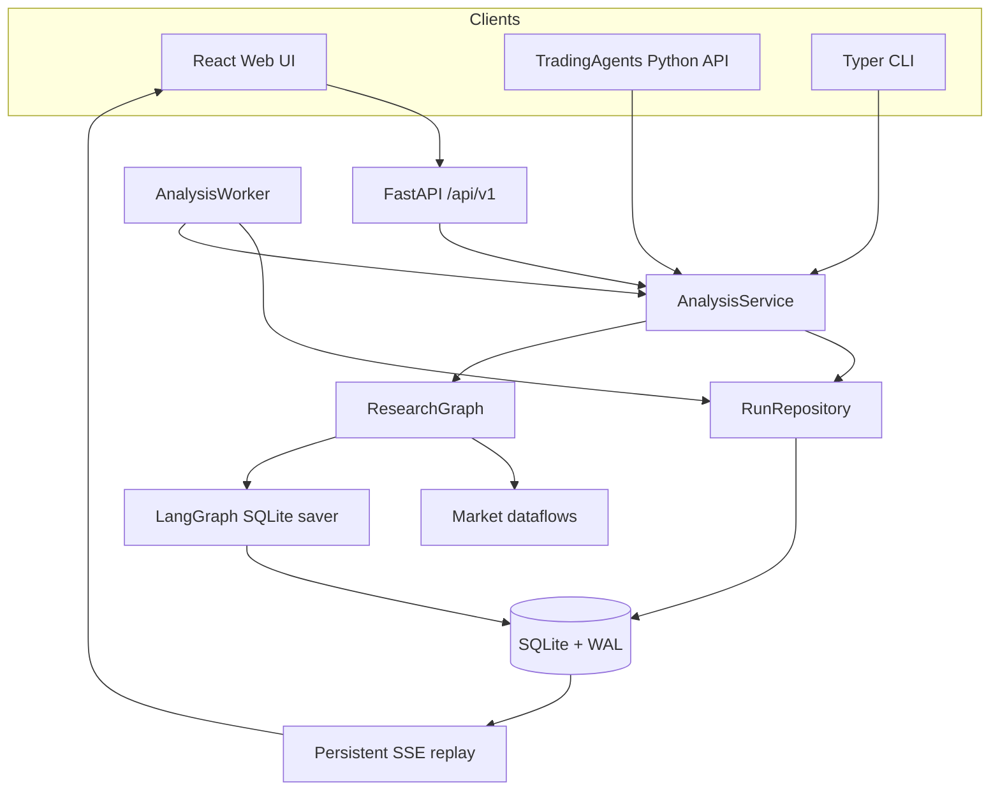
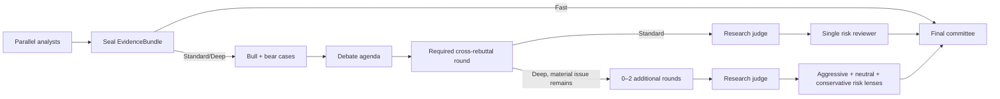

# TradingAgentsX Architecture

This document defines durable subsystem boundaries and correctness contracts.
Code and tests remain authoritative for exact schemas, limits, and provider
behavior. The product-line decision is recorded separately in
[ADR 0001](adr/0001-independent-product-line.md).

## Scope

TradingAgentsX is a local, single-user research system:

- one Web process and, by default, one analysis worker;
- one SQLite database on a local filesystem shared by those processes;
- US/default, Japanese, and mainland-China A-share equity data paths;
- research decisions, not accounts, holdings, cash, execution, or rebalancing;
- no multi-tenancy, collaboration, schedules, watchlists, or cross-host worker
  fleet in this architecture.

SQLite repositories and the LangGraph checkpointer may later be replaced by
PostgreSQL-backed implementations without changing public research contracts.
Redis is not part of the local architecture.

## System boundaries



### Public contracts

`tradingagents` exports:

- `TradingAgents`
- `AnalysisRequest`
- `AnalysisResult`
- `ResearchDecision`
- `RunProfile`

`TradingAgentsGraph` is not a public compatibility surface. Direct callers and
the CLI enter through `TradingAgents`/`AnalysisService`, which ensures that
persistence and lifecycle behavior cannot be bypassed accidentally.

`ResearchDecision` is intentionally account-free:

```text
rating
confidence
executive_summary
thesis
evidence_refs
catalysts
risks
invalidation_conditions
unresolved_questions
time_horizon
scenarios[base, bull, bear]
valuation_assessment
market_reference_levels
risk_review_adjustments
numeric_audit_status
```

Final Decision confidence is a rubric-based `low`, `medium`, or `high` research
support level rather than a numeric probability. Numeric confidence retained by
analyst, judge, and sentiment-stage contracts describes their bounded process
outputs and is not projected onto the final Decision contract.

Failed optional numeric candidates never enter `ResearchDecision`. A separate
`DecisionNumericAuditAppendix` may retain up to two sanitized, parsed JSON
snapshots (initial and repair), their safe validation issue codes, and the
components omitted from the canonical decision. It is persisted atomically
with the decision for user inspection and export, while ratings and thesis
generation use only the canonical decision.

Decision-critical calculations keep model-proposed formulas, named numeric
inputs, units, limitations, and evidence references. The strict qualitative
decision core also declares every derived exact number that materially affects
its thesis, risks, invalidation conditions, scenarios, or risk-review response.
Final qualitative serialization uses the provider's schema-focused client,
while Final numeric selection uses the corresponding reasoning client. For
DeepSeek V4 this means thinking-mode JSON Output followed by local Pydantic,
Evidence, formula, date, and semantic validation; JSON validity is not treated
as schema or research correctness.
Debate Agenda likewise uses the profile-selected reasoning client because
identifying material disagreements is a semantic research task rather than a
mechanical audit. Shallow Analyst and deliberation audits continue to use
schema-focused clients or deterministic extraction.
The numeric serializer must satisfy those declarations with calculation IDs;
each retained calculation publishes its decision-component uses. The
application evaluates formulas with a restricted arithmetic interpreter and is
the sole source of the canonical result and date. A missing or invalid optional
calculation degrades numeric audit status to `partial` without discarding an
otherwise valid qualitative decision. Canonical dates come from the latest
relevant Evidence Ledger effective date and are never guessed from the analysis
date.

Formula results remain in canonical units. Reader-facing compact quantities use
a separate, typed display scale (for example `hundred_million`); unit text is
never parsed to infer that scale. Ratio formulas for percent and percentage-point
values are converted by the application, as are ratio formulas expressed in
basis points. The persisted audit comparison therefore retains both the raw
canonical result and the deterministically scaled reader-facing value.
Reader-facing values that differ by no more than one declared last-place unit
and one percent relative error are retained as `approximately_matched`; this
does not weaken formula, unit, sign, Evidence, or PIT validation and does not
degrade an otherwise complete numeric audit. Display scale describes only the
formula result and is never inherited from an input's source measurement scale.
The application deterministically normalizes percentage, percentage-point,
basis-point, and multiple results to `base`; compact amount scales remain
explicit serializer declarations.
Serializer-facing operands remain ASCII identifiers. If a provider returns an
otherwise unambiguous Unicode identifier or an identifier-like token beginning
with a digit, the application performs boundary-aware token replacement and
rewrites the formula AST and operands to stable `v1`, `v2`, and later names
before validation. Pure numeric or punctuation-bearing names, collisions, and
incomplete mappings remain invalid; the application never guesses an ambiguous
mapping. Each observed formula input binds its value and date to Evidence; the
union of input date refs must be a subset of the calculation's input Evidence
refs. Unknown date refs and valid date refs omitted from that input set remain
distinct audit failures. A displayed derived range declares separate
low and high requirements, so one scalar requirement cannot validate two
different calculations.

Non-personalized ratings, conditional investment views, auditable valuation
ranges, scenarios, and market reference levels are allowed. Position
percentage, account configuration, order quantity/type, broker instructions,
mandatory entry/stop/take-profit levels, guarantees, and personalized
execution fields do not belong in this contract.

### Settings and runtime context

`AppSettings` and `RunSettings` are immutable Pydantic models.
`AppSettings.from_env()` is called at an application entry point; dotenv files
are never loaded as a package-import side effect. Daily defaults, provider connections and credentials live in SQLite and are
resolved by the shared configuration module. Environment files supply startup
settings and explicit import candidates; they never override initialized daily
configuration. Provider keys are excluded from Run configuration snapshots. Model connections
have stable IDs independent of vendor presets. Each quick/deep binding retains
a typed transport, compatibility policy, model and reasoning selection; the
application layer delegates vendor-specific behavior to the LLM subsystem.
The LLM subsystem resolves typed role and connection selections directly;
provider-specific environment aliases are handled only by explicit import
and the one-time predecessor conversion.
Connection credentials are scoped by ID and bound once per attempt. Admission
and retry recheck connection references under their SQLite write transaction,
so deletion cannot race a new queued reference.
Incremental creation resolves only the deep role and retains no quick binding. Internal submission identity retains
explicit overrides separately from resolved snapshots and is not exported.
See [Application configuration](configuration.md) for migration and precedence.

Every run resolves its own `RunSettings` and immutable `RunContext`. LangGraph
runtime context and `ToolRuntime` carry the request, analysis date, instrument
context, dataflow configuration, cancellation callbacks, and artifact/evidence
writers; the LangGraph runtime provides the event stream writer separately.
Analyst nodes read language and source policy from that explicit runtime
context. Every model-facing data tool requires this context and an injected
analysis date; each tool has one internal implementation. The sentiment analyst
prefetches its inputs and has no tool-call loop. Pure language and instrument prompt helpers live in `research/prompts`;
there is no mixed tool-and-prompt catalog. Full orchestration owns graph assembly,
while `research/full/evidence.py` seals producer material and
`research/full/state.py` owns graph state/output. Perspective objectives live in
`research/prompts/perspectives.py`. Runs carry no historical review context. Routing, adapters, assemblers and source
caches receive an explicit `DataRequestContext`; tool calls obtain it from the
Run runtime, and Incremental collection receives it from the application service.
No ambient configuration bridge remains. Credential redaction and bounded source
request scopes retain their separate isolation responsibilities.

Two runs with different provider, model, reasoning, language, or vendor
settings must remain isolated even if worker concurrency changes in the future.

## Application lifecycle

`AnalysisService` is the lifecycle owner. It:

1. normalizes and validates `AnalysisRequest`;
2. returns a matching original submission before consulting mutable defaults;
3. resolves and redacts configuration for a new submission and creates it atomically;
4. builds an independent Full run without retrieving historical review state;
5. builds per-run LLM clients and `RunContext`;
6. executes or resumes the graph;
7. persists events, reports, evidence, decision, metrics, and warnings;
8. cleans up or retains checkpoints according to terminal state;
9. leaves each completed Run readable through its Execution History.

Creation and retained history use separate request contracts.
`AnalysisRequest` is the admission contract for new research and for any
action that can launch research, including retry and source-based creation.
`RunRequestSnapshot` is a tolerant, read-only representation of the JSON
stored on a Run. Offline conversion retains predecessor JSON in a separate
audit snapshot and generates this normalized reading projection. Missing facts
remain missing; current settings never supply historical identity. Execution
crosses back through `AnalysisRequest` explicitly, so tightening admission
cannot make a retained Run unreadable or create a second creation path.

Graph nodes return state; they do not write files, reports, or application
tables.

### Run state and attempts

```text
queued → running → succeeded
                 ↘ failed
                 ↘ cancelled
```

The worker atomically claims one queued run and sets a lease. A process crash
leaves the run recoverable after lease expiry. Heartbeats extend active leases.
Starting an attempt means preparation, not result submission. Incremental
collection emits a start event and per-domain progress before synthesis; the
application emits `run.commit_started` immediately before persisting the final
result. Dataflow progress is scoped to the attempt, with event persistence and
logging owned by `AnalysisService`.
`tradingagents start` is a local foreground supervisor that health-gates and
monitors the otherwise independent Web and worker processes; production-style
and Docker deployments continue to manage those processes separately. Its
merged output retains child colors and adds distinct service labels. The first
interrupt requests cooperative shutdown and waits up to 30 seconds; a second
interrupt forces termination.

- `retry` is valid for a failed run, increments its attempt, and reuses the
  compatible checkpoint thread.
- a terminal run can seed an editable New Run form; submitting it creates a
  linked run with a new ID and fresh data/evidence snapshot.
- a queued cancellation becomes terminal immediately;
- a running cancellation is checked cooperatively at graph-node boundaries;
- supervisor shutdown returns a running claim to the queue at the next node
  boundary without changing its attempt or deleting its checkpoint;
- an in-flight provider call is force-killed only after the supervisor grace
  period, after which lease expiry provides crash recovery.

Successful and cancelled runs delete their checkpoint thread. Failed runs keep
it for retry or later trash cleanup.

### Trash lifecycle

Only terminal runs can be moved to Trash. A trashed run remains readable and
exportable, but is excluded immediately from default run listings, Dashboard
summaries, and recent-instrument suggestions. Restore is idempotent.

For Run-backed Research Nodes, the Full Node ID is also the lifecycle boundary
of its derived Research Cycle. An Incremental Node moves independently. Moving
a Full Node atomically moves every active direct Incremental child and records
the Full ID on each child moved by that cascade, so restore can leave previously
independent Trash entries untouched. Removing the Primary Full requires an
explicit active replacement when another Cycle remains; removing the final
active Full deletes the Primary pointer. Default Timeline reads include active
Nodes only, while an explicit Trash-state query exposes retained audit data.

Restore revalidates the current Full-baseline contract, active same-Cycle and
cutoff uniqueness, and the Primary pointer in one SQLite write transaction. A
child cannot be restored while its Full remains in Trash. Permanent purge of a
Full deletes its entire owned Cycle; Incremental purge remains Node-local. Both
manual purge and retention cleanup delete application-owned rows and every
owned checkpoint thread transactionally, without following template lineage,
Evidence references, or any cross-Cycle relationship.

The Web process performs one opportunistic expiry check at startup. The worker
checks before its first claim and uses a monotonic in-process deadline for
subsequent checks: 24 hours after success or one hour after failure. UTC
database timestamps determine the configured retention boundary. Cleanup uses
bounded SQLite write transactions, rechecks that each candidate is still
trashed before deletion, removes its checkpoint and owned application rows,
and detaches any child reruns. Concurrent Web/worker checks are therefore
idempotent. `TRADINGAGENTS_TRASH_RETENTION_DAYS=0` disables permanent cleanup.

`runs.instrument_name` stores the identity resolver's preferred general display
value (`short_name`, then `company_name`, `long_name`, or `name`). The optional
`instrument_local_name` stores a configured market source's local-language name
using the same run-time metadata-snapshot semantics. Neither name represents
the issuer name as of the analysis date. Resolution failure does not fail
research. The recent-instruments API deduplicates non-trashed runs by ticker and
never derives names from LLM output.

### Research workbench Web contracts

The Timeline Web API is cycle-shaped rather than a flat Node feed. A
`ResearchTimeline` contains whole `cycles`; every cycle carries one Full
`baseline` followed by its chronological `increments`. Pagination uses
`cycle_limit` and `cycle_offset`, so a Full-rooted cycle is never divided
between pages. Optional `focus_node_id` resolves a retained same-instrument Node
to its complete cycle page and returns the resolved `cycle_offset`; missing or
foreign Nodes return 404, and an explicitly focused Node excluded by the requested
Trash state returns 409. The Primary cycle is returned first and other cycles are ordered
by Full analysis date descending. This contract intentionally replaces the
pre-redesign `nodes` envelope without a compatibility layer.
`active_full_cycles` remains unpaginated and contains the compact decision
context required to choose a valid replacement before trashing a Primary
cycle; it does not hydrate reports, Evidence, or Incremental products.

New Run uses two bounded read models instead of loading Run Detail or scanning
Timeline pages. `baseline-candidates` returns only active, compatible Full
baselines before the requested date, with decision and display-name context.
`creation-template` returns only the terminal Run request snapshot and lineage
needed by the form; it does not read reports, Evidence, or artifacts. Run Detail
and Run Export embed the committed `research_node` products so Incremental
views and exports can render collection, availability, advancement,
performance, reassessment, and Full Research Required reasons directly.
Successful Incremental products also carry an audited Markdown analysis brief
generated by the existing semantic synthesis pass; it is attached outside the
strict serializer and therefore does not enlarge the structured-output schema.
Historical products may omit the brief. Run Detail exposes a bounded
`incremental_context` containing that brief and the direct Full baseline date
and Decision without reading baseline reports or artifacts. Export schema 12
adds the same brief plus the baseline Evidence bundle so JSON, Markdown, and
package exports remain self-contained.

Instrument names are current display metadata. New Incremental Runs inherit
their Full baseline names before best-effort resolution, and reads fall back to
the Full baseline for historical Incremental rows with missing names. No name
is treated as PIT Evidence or model output.

### Database

New installations use the independent Alembic baseline. Existing databases
must be converted offline from revision `0013_submission_identity` into a new
file; normal startup refuses the predecessor without upgrading it. See
[Offline database cutover](database-cutover.md) and [ADR 0007](adr/0007-independent-runtime-cutover.md).

Alembic manages application tables:

| Table | Responsibility |
| --- | --- |
| `runs` | request, redacted settings snapshot, status, lease, error, metrics |
| `run_attempts` | attempt state, checkpoint thread, lease and resume count |
| `run_events` | per-run monotonic sequence, attempt, node, sanitized payload |
| `run_artifacts` | versioned analyst, deliberation, and decision-stage artifacts, including component generation observations |
| `run_evidence` | independently sealed EvidenceBundle and digest |
| `decisions` | typed final decision, numeric audit appendix, market identity |
| `research_nodes` | same-identity successful Run role, direct Full-baseline relation, and Node-owned Incremental product JSON |
| `primary_research_cycles` | the only mutable per-instrument Timeline pointer |

LangGraph saver tables live in the same database file but remain owned by its
saver. Application code does not treat them as domain tables.

Every SQLite connection enables foreign keys, WAL, a bounded busy timeout, and
normal synchronous mode. WAL still permits only one writer at a time. The
database and `-wal`/`-shm` files must be on one host-local filesystem; NFS/SMB
deployment is unsupported.

`tradingagents db backup` calls the persistence-only SQLite online-backup seam
directly. It does not construct `AnalysisService` or run Alembic, so it is the
supported pre-migration backup boundary and preserves the source schema and
rows exactly as they exist when the copy starts.

### Events and SSE

Events are sanitized and committed before an in-process callback or SSE client
can observe them. `run_events.sequence` is unique and monotonically increasing
within a run.

`GET /api/v1/runs/{id}/events`:

1. takes the greater of `after` and `Last-Event-ID`;
2. replays committed events after that sequence;
3. polls for new events and emits periodic keepalives;
4. closes after the run reaches a terminal state.

Browser refresh therefore does not lose progress. SSE is one-way by design;
run mutations use ordinary HTTP endpoints.

## Evidence-first research graph

### Independent analyst channels

Market, Social/Sentiment, News, and Fundamentals collection agents begin in the
same LangGraph superstep but use independent local message state and tools.
After every collection channel completes, the graph seals and persists one
immutable EvidenceBundle before any formal report is written. The four report
writers then run in parallel with deterministic analyst-specific contexts
containing the collection memo, compact source passages, analytical views, and
table summaries/resampling; there is no LLM evidence-planning pass. A small
non-thinking audit-extraction step follows each Markdown report. The durable
`AnalystReport` handoff is:

```text
analyst
markdown
report_sections[{id, title, anchor, source_refs}]
confidence
key_claims[{id, section_id, kind, importance, statement, implication,
            confidence, evidence_refs}]
source_refs
audit_status: complete | incomplete
warnings
```

Markdown is the formal human-readable report. It may contain headings, lists,
and GFM tables, and is not reconstructed from typed rows or cells. A
non-thinking serializer extracts only the small navigation and claim audit
envelope. If that extraction still fails after one bounded repair, the Markdown
report is preserved with `audit_status=incomplete` and the graph continues. A
missing or truncated report body still fails the analyst node.

### Evidence sealing

Each `EvidenceItem` records:

```text
ref
source
evidence_type
requested_date
effective_date
available_at
content or value
unit
quality
fallback
provenance
```

`EvidenceBundle(version="8")` deduplicates items, validates unique references,
rejects effective dates after the analysis cutoff, interprets `available_at`
in the instrument's market timezone, and seals both evidence items and
deterministic raw `EvidenceTable` objects with a digest.

The sealed bundle is written to `run_evidence` independently of the run's final
status. Evidence sealing and its `evidence.sealed` event commit atomically, so a
running or failed run can still expose the immutable ledger. Analyst artifacts,
deliberation artifacts, and the final decision are also durable as soon as each
stage completes. Run diagnostics and explicit exports retain these partial
artifacts even when an attempt does not commit a Research Node.

`EvidenceTable` is an audit fact table containing canonical raw values and
source mappings. It is available on the Evidence page and as CSV in the
research package, but is never copied wholesale into a model prompt or forced
into a user report. Analysts receive a compact catalog, deterministic
analytical views, table summaries/resampling, and source passages that do not
duplicate a large fact table. Read-only local lookups operate on the sealed
artifacts without recontacting the provider.

Model-facing catalogs factor repeated metadata into explicit `item_defaults`;
each item's explicit fields override those defaults. Source-query passages
inherit unchanged catalog metadata by Evidence ref rather than repeating it.
Read-only query results and sealed Evidence remain complete. This is a rendering
projection, not a change to source selection, Evidence identity or PIT admission.
Analyst context character metrics measure the rendered prepared Evidence text;
they exclude the collection memo and remaining report instructions.

Data adapters may attach small producer-owned structured numeric facts (for
example analyst target prices and consensus EPS) beside readable source prose.
Evidence sealing converts those facts into `source_format=structured` tables,
so Final numeric audit does not scrape narrative text for a number, unit, or
observation date. Calculation inputs may identify only the Evidence refs that
establish their dates; explanatory background refs remain auditable without
advancing or blocking the calculation date.

### Markdown-first deliberation

Post-analyst roles use a deterministic `RoleContextBuilder`. Every prompt starts
with byte-identical system rules and a stable Research Dossier containing the
instrument, cutoff, report/claim index, and metadata-only Evidence catalog.
Role-specific material comes afterwards:

- bull/bear receive complete Analyst Markdown and primary evidence summaries;
- the agenda receives the two cases and claim index, and is generated directly
  as a small typed artifact;
- rebuttals receive the agenda, cases, prior rounds, and evidence already cited
  by those artifacts;
- the judge receives complete reports plus cases, agenda, and rebuttals;
- risk receives the judge, agenda, report risk sections, and cited evidence;
- final receives complete reports, judge, risk reviews, unresolved issues, and
  decision-critical evidence, but not complete case/rebuttal history.

There is no post-analyst LLM evidence-planning pass. The full raw
EvidenceBundle is never broadcast to research roles, while the stable prefix
allows the same provider/model to reuse its automatic context cache.

Visible research-process artifacts have separate contracts:

```text
ResearchCase       role plus readable Markdown
DebateAgenda       short summary plus prioritized issue IDs and questions
RebuttalReview     role Markdown plus addressed and open issue IDs
JudgeDraft         judge Markdown, preliminary rating, and issue dispositions
RiskReview         role Markdown plus challenged and unresolved issue IDs
ResearchDecision   strict final opinion, scenarios, calculations, and evidence
```

Cases and risk reviews use a reasoning-model Markdown write followed by a
deterministic intersection with the valid claim, section, and issue IDs already
present in graph state. Rebuttals and the judge use a small non-thinking audit
against an explicit valid-ID list. If that shallow audit cannot be validated,
the readable Markdown is preserved with `markdown_audit_incomplete`: Standard
continues with no open rebuttal issues, Deep conservatively keeps agenda issues
open, and a judge fallback leaves rating/confidence unknown while marking every
issue unresolved. Graph routing depends on stable issue IDs and dispositions,
not on parsing prose. The Final Committee uses a reasoning pass to form the
synthesis brief, a strict serializer for the qualitative decision core, and a
reasoning-client structured generation pass for the optional numeric appendix. Only derived,
decision-critical valuation, scenario, or market-reference arithmetic uses
`CalculationRecord`; directly observed market references remain evidence-backed
observations. A numeric appendix gets one bounded repair. If it still cannot be
fully audited, independently valid components are retained and the remaining
numeric fields are omitted with an explicit warning instead of discarding the
strict qualitative conclusion. Failed initial and repair candidates are kept
only as a size-bounded, recursively redacted numeric audit appendix; raw
provider messages, prompts, and hidden reasoning are never persisted.
Numeric repair includes its value/scenario/requirement catalogs exactly once:
repairs with a parsed candidate receive the catalogs as supplemental context,
while repairs without a candidate retain them in the original task. The repair
budget and numeric validation rules are unchanged. Analyst and deliberation
prompts ask for material reasoning and counterevidence without repeated report
retelling; they impose no hard narrative-length cap.

Every artifact records its prompt version and top-level structured generation
method. Agenda's top-level method describes Agenda generation; Final's
top-level method continues to describe the qualitative core. Component-level
`generation_observations` identify the logical client role, semantic-structured
or schema-serialization task, node, and final method for Agenda, Final core,
and Final numeric generation. These logical roles remain explicit even when a
provider reuses the same physical client. Historical artifacts without these
observations remain valid and are displayed as not recorded. No artifact stores
hidden reasoning traces or raw provider conversations.

All routed adapters return `DataResult`: human content, producer observations,
provenance, diagnostics and explicitly scoped spans travel together. Tools emit
model-visible content and a separate checkpointed artifact; prefetching analysts
carry the same serialized result. News caches store article identities, revisions
and original retrieval times. Neither graph stages nor Incremental collectors
recover provenance or news observations from Markdown or hidden text markers.
Stock adapters also return portable OHLCV rows with an explicit instrument and
adjustment basis. Full analytical views and Incremental Performance consume
these rows directly. Financial spans carry producer disclosure and period dates;
market calendars and cutoff admission remain in the market collectors.

### Profiles



- **Fast:** no debate; the committee directly synthesizes analyst reports.
- **Standard:** parallel bull/bear cases, a debate agenda, one required
  cross-rebuttal round, a judge draft, one integrated risk review, then a final
  committee.
- **Deep:** parallel bull/bear cases, a debate agenda, one required and at most
  two additional targeted rebuttal rounds, a judge draft, three parallel risk
  lenses, then a final committee.

Fast final synthesis and Standard judge/final synthesis use the deep model.
Other Standard deliberation roles use the quick model. Deep uses the deep
model for every case, agenda, rebuttal, judge, risk, and final role; analyst
tool collection and report synthesis continue to use the quick model.

Deep always executes its first targeted rebuttal. A later round requires a
materially open agenda issue plus new evidence, a new causal mechanism, or a
specific claim rejection; repeated thesis prose does not keep the loop alive.
Role nodes are produced from `RoleSpec`; separate persona modules do not
duplicate state copying and prompt assembly. There is no Trader node.

### Observable execution phases

Metrics and events use stable phase suffixes. They describe execution
responsibility rather than separate public graph nodes:

| Phase | Meaning |
| --- | --- |
| `collect` (or the base `analyst.<role>` node) | Deterministic data/tool collection; normally no LLM call |
| `context` | Deterministic role-context assembly; no provider call |
| `report`, `write`, `reason` | Reasoning-model report, deliberation Markdown, or final synthesis brief |
| `audit` | Schema-focused extraction of a small report/deliberation audit envelope |
| `debate.agenda.serialize`, `committee.final.serialize.numeric` | Semantic structured generation by the selected reasoning client |
| `committee.final.serialize.core` and other `serialize` phases | Schema serialization by a schema-focused client |
| other suffixes | Workflow or system activity outside the standard phases |

Per-phase wall time surrounds the actual operation, so LLM calls, tool calls,
tokens, and active time belong to the same phase. Run Detail groups phases by
research role in first-persisted-event order and exposes raw nodes on expansion.
The displayed role time is cumulative phase activity, not total elapsed time for
the parallel graph. Prepared contexts and attempt metrics remain separate
collapsible views.

## Research review boundary

The fixed-period Memory, Outcome, and Reflection lifecycle is retired. Migration
`0005_remove_legacy_memory` deliberately drops its persisted review tables and
does not convert historical Runs into Research Nodes. Runs, Attempts, Events,
Artifacts, sealed Evidence, Decisions, reports, exports, Trash, and restore
remain available through Execution History. Retained pre-redesign Decision JSON
may contain a `memory_refs` field; hydration drops that field while preserving
the current core Decision contract.

## Incremental research boundary

Incremental Research is a bounded update to one explicitly selected Full
Baseline, not a strict historical backtest or a chained revision. It receives
no sibling Incremental conclusion, seals only its own newly admitted Evidence,
and commits its Evidence, Reassessment, complete current `ResearchDecision`,
Node role, and fixed products atomically. Its direct Full Baseline bundle is
referenceable but is never copied into the current Node.

The semantic synthesis call produces both the readable Incremental analysis
brief and the source text used by strict structured serializers.
All synthesis stages use the same compact input projection. When source content
exactly matches a producer observation's kind, key and serialized values, the
projection supplies that structured observation once and labels the omitted
duplicate body. Any additional source text prevents this substitution. Original
Evidence, provenance, retrieval/publication times, source limitations and fallback
facts remain in the immutable bundle. The input also enumerates the valid Full
Baseline component IDs so serializers can copy them without inventing names.
The Method Snapshot versions this projection; historical snapshots are not rewritten.
Markdown Evidence references are normalized against the baseline and current
bundles before the brief is committed. A bounded assessment serializer then
produces the required Research Reassessment, whole-Decision outcome, outcome
reason, and Full Research Required reasons. An `unchanged` outcome skips full
Decision generation and materializes the baseline Decision exactly; an
`updated` outcome invokes the full Decision serializer and must produce a real
Decision-field change. An overturned component cannot be paired with
`unchanged`. Strengthened or weakened components may be paired with unchanged
when the complete baseline Decision remains valid verbatim.

The outcome is not a field patch and does not expand Research Reassessment into
a second Decision schema. Full Research Required remains an independent warning
and may accompany either outcome. The assessment and optional Decision stages
share one bounded structured-output repair budget, so splitting the serializers
does not multiply retries. Atomic commit and Evidence Reference Closure apply
to the assembled Decision in both branches.

The Incremental collector reuses the Run's configured routers and existing
market assemblers. A provider may receive an exact interval or a broader range
that the producer truncates locally. The product records actual selected
sources, admitted observations, material limitations, and sanitized failures;
it does not mirror the configured chain into a second provider registry, model
every unattempted fallback as a product result, or certify an exhaustive scan
when the provider exposes only a bounded feed.

Information Advancement requires genuine new information: newly admitted PIT
Evidence, qualified Near-live Advisory Evidence, or a newly completed stock
session used by the current research product. Elapsed time, provider success
without usable information, a repeated observation whose only change is its
retrieval time, and an unproven empty response do not advance a Run. A thin
Research Availability summary discloses which research domains were available,
limited, or missing without claiming historical or provider completeness.
Missing optional inputs do not by themselves require a new Full Research Run.

Stock Vendor-adjusted Return is the deterministic v1 Performance requirement.
Its two endpoints come from one disclosed provider/adjustment/retrieval series;
that series may also supply market Evidence. The price Evidence's own origin
binds its retrieval timestamp and fallback status to the calculation; the
domain's source summary may include later observations from the same provider.
Named benchmark returns are
independent optional context and never block a calculated stock return or an
otherwise valid Incremental Node. The stock component itself is always recorded
but may be Not Yet Observable or unavailable; an unavailable result does not
block a Node that has other genuine Information Advancement. Stock-minus-
benchmark arithmetic, when shown, is a Reported Benchmark Difference and never
Alpha.

[ADR 0005](adr/0005-bounded-best-effort-incremental-data.md)
supersedes the original complete-empty advancement, mandatory source-level
Coverage audit, dual-benchmark parity, and v1 Outcome Review design.
Full-rooted Cycle, slot uniqueness, Evidence ownership, reference closure, and
atomic lifecycle invariants remain unchanged.

## Data routing and point-in-time contracts

### Symbols and market dates

`normalize_symbol` converts low-level vendor aliases to canonical
Yahoo-compatible symbols before routing. Public creation additionally applies
the positive `is_supported_equity_symbol` predicate: only United States
equity notation, four-character Tokyo `.T` symbols, and validated mainland
Shanghai/Shenzhen A-share symbols are admitted. Broker forex, commodity,
index, and adjacent-exchange aliases remain low-level capabilities; they are
not product-market support. Ambiguous or unsupported mainland symbols fail
loudly. Common bare index aliases are rejected before provider access, while
symbols that are also real equity tickers continue to the strict eligibility
stage.

After deterministic candidate validation, `AnalysisService` performs strict
instrument eligibility through one injected resolver before new Run
creation. Idempotent replay returns the retained Run before this lookup. Only a
single exact canonical-symbol result classified as equity is admitted. A known non-equity raises `unsupported_instrument` (HTTP 422); an
empty, ambiguous, mismatched, unknown, or failed classification raises
`instrument_eligibility_unavailable` (HTTP 503). Execution repeats this check
before graph construction and data routing so queued legacy candidates cannot
cross an upgraded boundary. Eligibility metadata is admission/display data,
not point-in-time Evidence, and internal benchmark/provider identifiers remain
outside this public seam.

The default resolver uses the same configured routing infrastructure as other
data adapters, under the dedicated `instrument_eligibility` category (shipped
as `yfinance`). An unimplemented configured provider fails closed, and adapter
transport or rate-limit failures retain the shared vendor-error semantics until
they are mapped to the public eligibility-unavailable error.

The analysis cutoff uses the instrument market's timezone, never the host's
calendar or an unconditional UTC date. Historical tools receive that cutoff
from runtime context rather than an LLM-provided argument.

The Web client obtains the current market-local boundary from the server's
instrument Analysis Cutoff context. That context is a deterministic calendar
lookup, not an instrument-eligibility decision: strict vendor-backed equity
admission still occurs when the Run is created. Run creation re-evaluates the
same boundary and returns a typed validation error when a requested Analysis
Cutoff is in the instrument market's future.

Sources truncate strict PIT observations to the cutoff. A disclosure/update
source uses the conservative visibility boundary. Retrieval-time snapshots may
be admitted only as explicitly non-PIT Near-live Advisory Evidence when the
Analysis Cutoff is today or one of the preceding five market-local calendar
dates. They may inform research but cannot prove historical completeness,
historical absence, or strict historical availability for their domain; older
live-only values are withheld. Absence remains unknown rather than becoming
neutral or bearish.
When a live-only response is cached, its producer-owned retrieval timestamp is
cached with the payload and reused by consumers; cache hits are never restamped
at assembly time.

### Shared observations and bounded news continuity

`domain/data_result.py` defines source content, observations, provenance,
diagnostics and bounded temporal spans independently of transport text.
Professional signals and the cross-region macro panel return this result directly;
Full and Incremental read their producer observations and numeric facts without
an ambient observation sink.
The market signal registry adds source policy and retains bounded failure handling.

`source_observations` transports producer-owned records beside existing tool
strings. Full fundamental prefetch and Incremental collectors consume the same
financial summaries; professional signals and macro observations retain their
actual dates, units and retrieval provenance. Stable semantic observation IDs
support baseline comparison without treating a refreshed timestamp as new
information. Financial comparison periods travel with the latest visible release
as context. Existing Node ownership and atomic sealing remain authoritative.

`incremental_inputs.collect_news_observations` shares the structured ticker-news
collection, fallback binding and limitation retention across the three markets.
Market adapters retain their text-only response handling. Full uses one admission
guard for captured, prefetched and cached structured observations, applying the
near-live boundary to original retrieval times and retaining unavailable-source
diagnostics when values are withheld. Its pre-existing rendered macro panel still
describes observation-date windows, including historical/non-vintage limitations;
the new guard does not turn that panel into a publication-time archive.

`news_selection` applies common candidate deduplication and temporal allocation.
`news_cache` persists relevant candidates in a separate, bounded SQLite source
cache under `data_cache_dir`, before final output truncation. Exact refresh reuse
is request-triggered; source configuration, window and budget constrain reuse.
Cached retrieval times are preserved, unknown-time revisions remain near-live,
and cache failures degrade to ordinary collection. Source/query availability
notes are diagnostics, not articles or content revisions. Global feeds use UTC
dates; their refresh signature includes the output target as well as the
per-query candidate budget, since the target controls early query stopping.
This cache neither stores research conclusions nor certifies historical
completeness. See
[Full and Incremental data inputs](data-inputs.md) for source limits, defaults,
selection behavior and admission details.

### Vendor chains and assemblers

Configuration resolution remains:

1. `tool_vendors[method]`
2. `data_vendors_by_market[suffix][category]`
3. `data_vendors[category]`

A comma-separated value is an exact ordered fallback chain. The router never
adds an unconfigured vendor. First-success routing and multi-source composition
are different operations: an assembler owns composition, fault isolation,
deduplication, and final caps.

| Market | Prices/indicators | Fundamentals/statements | Ticker news |
| --- | --- | --- | --- |
| US/default | yfinance | yfinance | yfinance |
| Japan `.T` | J-Quants → yfinance | JP assemblers → J-Quants → yfinance | EDINET + TDnet + Google News → yfinance |
| China `.SS`/`.SZ` | Tencent qfq → Eastmoney qfq → yfinance | CNINFO + Sina → yfinance | CNINFO + Eastmoney Research + Google News → yfinance |

Ticker-less global news, macro, and prediction markets stay market-agnostic.
Macro panel cells fail independently and retain actual-source/fallback
provenance.

### Failures and quality

Adapters use the typed vendor failure taxonomy. Missing configuration,
rate-limit, transport, schema, stale, and valid-empty outcomes remain
distinguishable. Retries, timeouts, caches, and HTTP behavior stay local to an
adapter or its subsystem utility.

Material fallback, missing/partial coverage, truncation, staleness, and
non-PIT/non-vintage limitations become typed warnings. A successful empty news
window is not itself a warning.

## Security boundary

The normal server binds to loopback and needs no login. LAN mode requires one
environment token; the login endpoint exchanges it for a signed, expiring,
`HttpOnly`, `SameSite=Strict` cookie. Mutating requests validate same origin.

Provider and data-service keys are stored only in the dedicated configuration
credential table and are bound to execution-scoped memory at attempt start. They
must not enter Run tables, graph state/checkpoints, events, SSE, research exports,
API errors, application logs or browser persistent storage. Credential-scoped
logging redacts records before handlers receive them; terminal worker diagnostics
are captured before the execution context exits, including exception cause chains.
Ordinary settings/capability endpoints
expose only presence; an explicit same-origin reveal endpoint returns the selected
key with caching disabled. Whole-database backups contain credentials. LAN tokens
and session secrets remain startup-only. Raw provider exceptions and sensitive
tool arguments remain excluded from events, API errors and browser logs.

This is a single-user local boundary. It does not provide TLS, user accounts,
roles, tenant isolation, or Internet-facing hardening.

## Validation boundaries

The default suite is offline; [test responsibilities](testing.md) identifies each
behavior owner and verification boundary. It covers configuration isolation, lifecycle
transitions, lease recovery, event ordering, checkpoint resume/cleanup,
SSE replay, cancellation/retry/run templates, SQLite backup, migration,
point-in-time evidence sealing, API security, frontend behavior,
wheel contents, and Docker startup.

These offline checks validate product contracts but do not measure comparative
model research quality, latency, or token improvement. Any future benchmark
must be designed around a small set of scenarios that can actually be run and
recorded.

## Implementation map

The root package intentionally exposes only `TradingAgents`, `AnalysisRequest`,
`AnalysisResult`, `ArtifactGenerationObservation`, `ResearchDecision`,
`RunProfile`, and `__version__` as its
public Python API. Specialized contracts remain owned by their subsystem
modules.

- Public API: `tradingagents/client.py`,
  `tradingagents/domain/runs.py` and `tradingagents/domain/decision.py`
- Lifecycle: `tradingagents/application/service.py`
- Worker: `tradingagents/application/worker.py`
- Repository/schema: `tradingagents/persistence/repository.py`,
  `tradingagents/persistence/models.py`
- Configuration documents and resolution: `tradingagents/configuration/`
- Configuration persistence: `tradingagents/persistence/configuration.py`
- Model protocols and construction: `tradingagents/llm/`
- Migrations: `tradingagents/persistence/`
- Graph: `tradingagents/research/full/workflow.py`
- Analysts, tools, prompts and state: `tradingagents/research/`
- Incremental synthesis and recovery: `tradingagents/research/incremental/synthesis.py`
- CLI: `tradingagents/cli/`
- HTTP/security: `tradingagents/web/`
- React application: `frontend/`
- Routing: `tradingagents/data/interface.py`
- Japan/China: `tradingagents/data/jp/`,
  `tradingagents/data/cn/`

The domain package owns typed research contracts and pure rules; it does not
import application orchestration, persistence, market adapters or SDK clients.
Research receives a scoped runtime context and explicit artifact/evidence sinks.
Research synthesis separates readable deliberation, serializer drafts, decision
prompt guidance, qualitative generation, numeric preflight, numeric generation,
audit assembly and formula/display rules. These modules preserve generation
budgets and exchange typed products; numeric audit does not invoke providers.
The repository composes private execution, research-write, Timeline-query,
artifact and lifecycle operations over a shared session factory. Operations that
commit a research result retain their complete transaction boundary. Full
completion always commits a Decision and Research Node; Incremental uses its
own atomic product commit. Runs without Nodes represent uncommitted execution
history and cannot use the old successful-without-Node completion path.

### Research workspace presentation

The Web library filters active Timeline summaries by optional `q` (instrument
code or stored display names, case-insensitive) and `warning_only` before
pagination. `total` counts the filtered set. `primary_head_run_id`,
`primary_analysis_date`, rating, and confidence derive from the same Primary
Cycle head; `latest_analysis_date` still describes the latest active research
across cycles. These are derived reads and introduce no persistence migration.

The instrument route `/timelines/:instrument?node=:id` is the research reader.
Run routes `/runs/:id` show execution and diagnostics; retired reading query
values do not redirect to research. Selecting history does not select a Primary
Cycle. Technical snapshots, recovery records, numeric audit appendices, and
raw events are available on the Run diagnostics page; evidence and consequential
limitations stay reachable from research reading. Presentation never rewrites
stored reports or export products. The dashboard uses bounded summary and Run
list requests, without loading individual reports.

### Workspace summaries and cycle task groups

Timeline summaries include the Primary baseline date and current thesis from the
same Primary head used for its rating. `sort=recent_activity` orders instruments
by the latest recorded completion time of active research; the default analysis-date
ordering is unchanged. Latest completed run/cycle/date metadata remains separate
from the Primary assessment, including when another cycle completed more recently.

`GET /api/v1/run-groups` matches the existing task filters before paging complete
groups. A committed Full baseline supplies the parent context even when only an
Incremental task matches. Committed children and related uncommitted tasks occupy
separate arrays. Independent Full tasks are standalone groups.
These reads do not load reports, Evidence or artifacts and create no new tables.

`POST /api/v1/runs/lifecycle-preview` is a read-only ownership preview. It returns
all affected records, immediate blockers and replacement Primary candidates.
Trash/restore/purge accept optional `expected_affected_run_ids`; under the existing
write transaction lock the repository recomputes ownership and rejects changed
scope before any mutation. Existing callers may omit the field. Actual transition,
compatibility and uniqueness validations remain authoritative at submission.
Related uncommitted tasks never become owned nodes merely because they are grouped
under a baseline in the UI. Restore retains the existing cascade provenance rules.

Frontend composition and routing live in `frontend/src/app`. Research reading
and creation, execution diagnostics, and settings live in `features/research`,
`features/runs`, and `features/settings`, with adjacent tests and styles. Shared
UI primitives, hooks, and generated API contracts live in `shared`.
