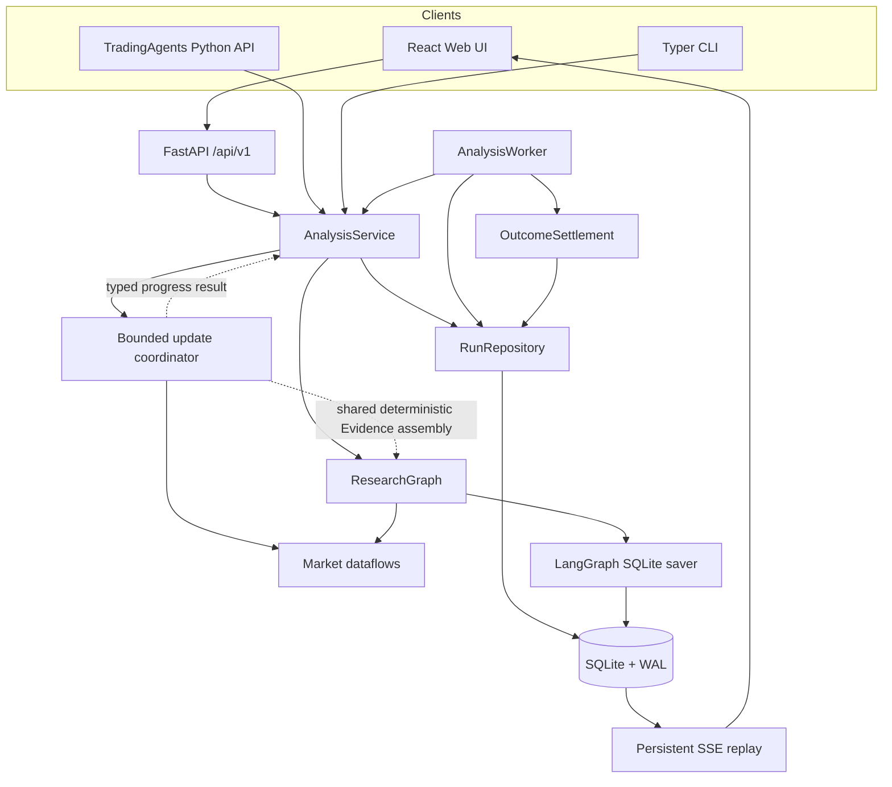
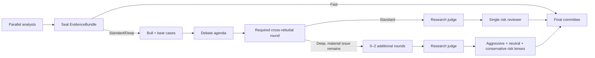

# TradingAgentsX Architecture

This document defines durable subsystem boundaries and correctness contracts.
Code and tests remain authoritative for exact schemas, limits, and provider
behavior. The product-line decision is recorded separately in
[ADR 0001](adr/0001-independent-product-line.md).

## Scope

TradingAgentsX is a local, single-user research system:

- one Web process and, by default, one analysis worker;
- one SQLite database on a local filesystem shared by those processes;
- US, Japanese, and China A-share equity data paths;
- research decisions, not accounts, holdings, cash, execution, or rebalancing;
- no multi-tenancy, collaboration, schedules, watchlists, or cross-host worker
  fleet in this architecture.

SQLite repositories and the LangGraph checkpointer may later be replaced by
PostgreSQL-backed implementations without changing public research contracts.
Redis is not part of the local architecture.

## System boundaries



### Public contracts

`tradingagents` exports:

- `TradingAgents`
- `AnalysisRequest`
- `AnalysisResult`
- `ResearchDecision`
- `RunProfile`

`TradingAgentsGraph` is not a public compatibility surface. Direct callers and
the CLI enter through `TradingAgents`/`AnalysisService`, which ensures that
persistence and lifecycle behavior cannot be bypassed accidentally.

`ResearchDecision` is intentionally account-free:

```text
rating
confidence
executive_summary
thesis
evidence_refs
memory_refs
catalysts
risks
invalidation_conditions
unresolved_questions
question_source_dependencies[{question, required_sources}]
time_horizon
scenarios[base, bull, bear]
valuation_assessment
market_reference_levels
risk_review_adjustments
numeric_audit_status
```

Failed optional numeric candidates never enter `ResearchDecision`. A separate
`DecisionNumericAuditAppendix` may retain up to two sanitized, parsed JSON
snapshots (initial and repair), their safe validation issue codes, and the
components omitted from the canonical decision. It is persisted atomically
with the decision for user inspection and export, but memory retrieval,
outcome settlement, ratings, and thesis generation ignore it.

Decision-critical calculations keep model-proposed formulas, named numeric
inputs, units, limitations, and evidence references. The strict qualitative
decision core also declares every derived exact number that materially affects
its thesis, risks, invalidation conditions, scenarios, or risk-review response.
Final qualitative serialization uses the provider's schema-focused client,
while Final numeric selection uses the corresponding reasoning client. For
DeepSeek V4 this means thinking-mode JSON Output followed by local Pydantic,
Evidence, formula, date, and semantic validation; JSON validity is not treated
as schema or research correctness.
Debate Agenda likewise uses the profile-selected reasoning client because
identifying material disagreements is a semantic research task rather than a
mechanical audit. Shallow Analyst and deliberation audits continue to use
schema-focused clients or deterministic extraction.
The numeric serializer must satisfy those declarations with calculation IDs;
each retained calculation publishes its decision-component uses. The
application evaluates formulas with a restricted arithmetic interpreter and is
the sole source of the canonical result and date. A missing or invalid optional
calculation degrades numeric audit status to `partial` without discarding an
otherwise valid qualitative decision. Canonical dates come from the latest
relevant Evidence Ledger effective date and are never guessed from the analysis
date.

Formula results remain in canonical units. Reader-facing compact quantities use
a separate, typed display scale (for example `hundred_million`); unit text is
never parsed to infer that scale. Ratio formulas for percent and percentage-point
values are converted by the application, as are ratio formulas expressed in
basis points. The persisted audit comparison therefore retains both the raw
canonical result and the deterministically scaled reader-facing value.
Reader-facing values that differ by no more than one declared last-place unit
and one percent relative error are retained as `approximately_matched`; this
does not weaken formula, unit, sign, Evidence, or PIT validation and does not
degrade an otherwise complete numeric audit. Display scale describes only the
formula result and is never inherited from an input's source measurement scale.
The application deterministically normalizes percentage, percentage-point,
basis-point, and multiple results to `base`; compact amount scales remain
explicit serializer declarations.
Serializer-facing operands remain ASCII identifiers. If a provider returns an
otherwise unambiguous Unicode identifier or an identifier-like token beginning
with a digit, the application performs boundary-aware token replacement and
rewrites the formula AST and operands to stable `v1`, `v2`, and later names
before validation. Pure numeric or punctuation-bearing names, collisions, and
incomplete mappings remain invalid; the application never guesses an ambiguous
mapping. Each observed formula input binds its value and date to Evidence; the
union of input date refs must be a subset of the calculation's input Evidence
refs. Unknown date refs and valid date refs omitted from that input set remain
distinct audit failures. A displayed derived range declares separate
low and high requirements, so one scalar requirement cannot validate two
different calculations.

Non-personalized ratings, conditional investment views, auditable valuation
ranges, scenarios, and market reference levels are allowed. Position
percentage, account configuration, order quantity/type, broker instructions,
mandatory entry/stop/take-profit levels, guarantees, and personalized
execution fields do not belong in this contract.

### Settings and runtime context

`AppSettings` and `RunSettings` are immutable Pydantic models.
`AppSettings.from_env()` is called at an application entry point; dotenv files
are never loaded as a package-import side effect. Provider keys remain in the
process environment and are excluded from persisted configuration snapshots.

Every run resolves its own `RunSettings` and immutable `RunContext`. LangGraph
runtime context and `ToolRuntime` carry the request, analysis date, instrument
context, dataflow configuration, memory, cancellation callback, and event
writer. The dataflow `ContextVar` bridge exists only to support established
adapter signatures during one scoped invocation; there is no mutable package
configuration or `set_config()` operation.

Two runs with different provider, model, reasoning, language, or vendor
settings must remain isolated even if worker concurrency changes in the future.

## Application lifecycle

`AnalysisService` is the lifecycle owner. It:

1. normalizes and validates `AnalysisRequest`;
2. resolves and redacts run configuration;
3. creates or idempotently returns a run;
4. prepares an explicit empty `MemoryContext`; neither ordinary nor Research
   Chain executions retrieve legacy Decision memory while Outcome Feedback
   Context remains deferred;
5. builds per-run LLM clients and `RunContext`;
6. executes or resumes the graph;
7. persists events, reports, evidence, decision, metrics, and warnings and,
   for an explicitly requested initial chain, atomically commits its first
   Research Revision;
8. cleans up or retains checkpoints according to terminal state;
9. creates a pending Outcome Observation for background settlement.

Graph nodes return state; they do not write files, reports, or application
tables.

Every Research Execution freezes one timezone-aware Information Frontier before
source collection. A current-day execution freezes it only after market
readiness succeeds; a historical execution uses the end of its market-local
Research Cutoff. Failed readiness does not persist an unusable frontier, while
retries after collection begins reuse the execution's existing frontier. New
Research Revisions retain that boundary separately from their market-local
Research Cutoff; legacy Revisions without a provable boundary remain readable
with no synthesized frontier.

An anchor-required Japanese initial Full execution first runs a deterministic,
zero-LLM readiness operation over the profile's minimum Official Filing, Timely
Disclosure, and Market Observation capabilities. It retains only typed source
frontiers, limitations, reasons, and deterministic metrics, and freezes the
intended Information Frontier only after that operation succeeds. An ordinary
initial Full execution may explicitly select `allow_non_anchor`; this visible
request policy skips the anchor claim and may create a Full-only Research Chain
whose resulting Revision must independently qualify before bounded updates are
allowed.

The same complete readiness gate runs before any Full Research Chain update
that may establish its next Forward Research Anchor. When a predecessor exists,
event-source observations must cover the interval from that anchor's frontier;
an archive limitation confined before it remains visible, while a gap after it
fails readiness before LLM construction.

After parallel Full collection converges, anchor-required executions compare
the graph-visible sealed Evidence with the successful readiness source
manifest before analyst synthesis. Missing Required source records, watermarks,
or selected market/fundamental datasets fail with a typed admission reason
before the case, debate, risk, or committee stages. Ordinary explicitly
non-anchor Full executions retain their existing degraded-evidence behavior.
The successful manifest is immutable across attempts of the same run. Event
source frontiers retain returned/reported counts, a digest of the observed
record-version closure, and typed limitations; retries reuse both that manifest
and the first sealed Evidence bundle rather than recollecting against a weaker
boundary or creating a different seal timestamp.

### Run state and attempts

```text
queued → running → succeeded
                 ↘ failed
                 ↘ cancelled
```

The worker atomically claims one queued run and sets a lease. A process crash
leaves the run recoverable after lease expiry. Heartbeats extend active leases.
`tradingagents start` is a local foreground supervisor that health-gates and
monitors the otherwise independent Web and worker processes; production-style
and Docker deployments continue to manage those processes separately. Its
merged output retains child colors and adds distinct service labels. The first
interrupt requests cooperative shutdown and waits up to 30 seconds; a second
interrupt forces termination.

- `retry` is valid for a failed run, increments its attempt, and reuses the
  compatible checkpoint thread.
- `source_run_id` remains a legacy template relation for compatible API
  callers, but it is not exposed in the primary reader flow and is never used
  as Research Chain lineage or a Forward Research Anchor;
- a queued cancellation becomes terminal immediately;
- a running cancellation is checked cooperatively at graph-node boundaries;
- supervisor shutdown returns a running claim to the queue at the next node
  boundary without changing its attempt or deleting its checkpoint;
- an in-flight provider call is force-killed only after the supervisor grace
  period, after which lease expiry provides crash recovery.

Successful and cancelled runs delete their checkpoint thread. Failed runs keep
it for retry or later trash cleanup.

### Initial Research Chains

A user may explicitly request that a Full Analysis establish longitudinal
research. The run remains the Research Execution and uses the unchanged Full
ResearchGraph inputs. After the graph succeeds, the application performs
Research State Assembly from the sealed Evidence, reports, and final decision.
It assigns opaque Claim and Question identities and validates a complete,
versioned Current Research State, Coverage Attestation, Update Summary, and
Effective Evidence Snapshot.

The repository commits the successful run, a new linear Research Chain, and
its immutable first Research Revision in one SQLite transaction. The first
chain for a normalized Instrument becomes Primary; later alternative chains
do not replace it automatically. Failed or cancelled executions create no
chain or Revision. Ordinary Full Analysis runs remain independent unless the
user selected the chain-creation workflow explicitly.

Each Revision owns its complete state and Evidence snapshot. Its producing-run
link uses `ON DELETE SET NULL`, so trash expiry can remove the execution audit
without deleting or weakening the immutable research state. The API, Web
reader, and Revision exports read the Revision directly rather than replaying
the producing run.

Revision Role (`initial` or `update`), Execution Strategy (`full` or
`incremental`), and Change Conclusion are separate persisted fields. An
initial Revision has no Change Conclusion. An update records Material Change,
No Material Change, or Indeterminate; Full execution alone never implies
Material Change. The unreleased `0008` migration derives role from structural
predecessor lineage, preserves explicit historical update outcomes, leaves an
initial Change Conclusion null, and retains the old `outcome` column only as a
downgrade compatibility source. Application contracts never read it as current
semantics. The legacy `coverage_incomplete` Revision outcome is migrated
directly to Indeterminate; coverage JSON by itself never creates a Change
Conclusion. Version-1 Shadow audit JSON is structurally migrated to the typed
version-2 contract, and downgrade rewrites both audit JSON and compatibility
outcomes into values understood by the prior application.

For Japanese disclosures, the Effective Evidence Snapshot also carries stable
EDINET/TDnet Source Record identities, immutable observed Source Record Version
identities, per-version new/inherited lineage, and source-specific Watermarks.
Version identity is independent of the requested analysis date, so overlapping
collection can re-observe and deduplicate a version while retaining superseded,
corrected, withdrawn, or replaced versions. Watermarks record the interval
actually scanned plus archive, truncation, and availability limitations; they
are not inferred from an empty result. Disjoint intervals remain separate and
an unscanned gap downgrades Required coverage instead of being treated as one
continuous scan.

Japanese J-Quants fundamentals use a stable issuer/period Source Record identity,
retain each upstream disclosure number as the version's native record identity,
and carry an explicit accounting-period comparison key. These fields classify
new filings, corrections, restatements, accounting-scope changes, and otherwise
unclassifiable differences across snapshots without conflating logical identity
with an individual upstream disclosure. A latest visible disclosure more than
180 days before the analysis cutoff marks the snapshot limited. Adjusted
market history records its provider, adjustment contract, latest observation,
unit, precision, and actual returned warm-up start separately from the requested
scan cutoff. The Current Research
State retains audited market reference levels, and a Revision delta records
ordinary movement separately from a deterministic crossing of one of those
levels. Provider, adjustment, or unit drift is an incompatible market signal,
not an unchanged observation.

### Full Research Chain updates

In `off` mode a manual update targets exactly the current Revision of one
Research Chain and requires a strictly later cutoff. The application records
one Update Intent on the existing run execution boundary. Duplicate
submissions for the same head and request resolve to the same run, while
retries add an attempt to that execution. A partial unique constraint prevents
concurrent queued or running updates for one chain.

The ResearchGraph receives only the new `AnalysisRequest` and runs the existing
Full Analysis pipeline without Prior Research. After Full Evidence and the
independently assembled candidate Current Research State are sealed, but before
comparison with the current predecessor Revision, the application runs a
bounded Question Disposition step. Its structured result may refer only to baseline and
candidate Question IDs assigned by application code, references from bounded
current Full Evidence summaries (including content and PIT timing), one
disposition, an optional successor, and a concise reason.
Only complete one-to-one mappings are applied. Answered and reopened Questions
retain their ID; superseded Questions retain their ID and link to a separately
assigned successor ID. A Full decision's omission never changes a Question.

The structured step receives one repair attempt. A second invalid result,
current-Evidence violation, incomplete coverage of baseline Questions, or
ambiguous identity preserves every baseline status and retains unmatched Full
Questions as new objects. The Revision records the stable limitation in its
delta, Question coverage, Update Summary, and event audit. Without an
independently established Material Change this makes the Revision
Indeterminate with reason `question_disposition_limited`; independently
established Material Change remains authoritative while exposing the
limitation. Claim identity comparison then runs together with the applied
Question dispositions. The immutable Revision stores the typed delta, complete
Current Research State, Coverage Attestation, Update Summary, Effective
Evidence Snapshot with inherited/new lineage, Full artifacts, and metrics.
Each disposed Question retains its latest disposition and reason in Current
Research State, so the reader can distinguish a reopened Question from an
ordinary open Question without reconstructing the delta.

Coverage Attestation distinguishes Required and Advisory source domains.
EDINET and TDnet company disclosures are Required for Japanese disclosure
coverage. Google News is Advisory unless an active Claim or open Question
explicitly names it as Required. Limited or unavailable Required coverage, and
observed official correction or withdrawal states, are represented as blocking
a quiet reassessment when first observed; an already assessed inherited version
does not become a permanent blocker. Google News watermarks are live-only, so
Required Google coverage cannot establish No Material Change. A semantically
unchanged Full update with one of these blockers creates an Indeterminate
Revision with stable reason `coverage_incomplete`, not No Material Change or a
fabricated Material Change. It becomes the readable and exportable head, and
independently qualifies as a Forward Research Anchor only when its resulting
Current Research State satisfies Anchor Coverage.

Near-live Advisory Evidence may appear in the same Revision and inform its
reports, risks, catalysts, and Research Opinion without satisfying or poisoning
Anchor Coverage. If a Claim or open Question promotes its live-only source to
Required, that source remains limited and blocks Anchor qualification.

When their analyst domains are selected, J-Quants fundamental snapshots and
adjusted market history are Required for Japanese coverage. Missing, stale,
partial, incompatible, truncated, or insufficient-warm-up observations block a
quiet reassessment. Social sentiment and broad media remain Advisory unless an
active Claim or open Question promotes a named source to Required.

The repository commits the successful execution, new Revision, and changed
chain head in one SQLite transaction after rechecking the baseline. Failure,
cancellation, invalid state, or a stale baseline therefore leaves the prior
head unchanged. Historical runs and decision-memory rows are never inferred
into Research Chains.

Before the transaction advances the head, the Revision contract enumerates
every Evidence reference reachable from Current Research State, Coverage,
delta, Update Summary, and typed update audit. Every reference must resolve in
the same Effective Evidence Snapshot, and every Source Record replacement must
resolve to a Source Record Version there. Bounded Evidence retained by a
Shadow audit is merged into the authoritative Full snapshot for this purpose.
A closure failure rejects the Revision while the failed Research Execution and
its sanitized audit remain durable.

The server derives the head's next-update policy independently from role and
conclusion. Complete state, Evidence closure, Required/object coverage, and
compatible market semantics yield `incremental_allowed`; otherwise the API
returns `full_required` and a stable reason. Change Conclusion does not decide
future anchor eligibility: an Indeterminate Full head with complete Anchor
Coverage may become the comparison anchor, while incomplete candidate coverage
cannot repair an unqualified baseline.

### Shadow incremental updates

Manual Japanese Research Chain updates begin with a bounded, deterministic
collection phase before any LLM client is created. The phase rechecks EDINET
and TDnet with overlap, collects selected or thesis-required J-Quants
fundamental and adjusted-market snapshots, and labels contextual sources
Advisory. Required sources are derived from active Claims and open Questions;
EDINET and TDnet remain Required for Japanese chains, and audited market
reference levels require compatible adjusted-market coverage.

A Required source dependency names an external data source, not an Evidence,
Evidence Table, memory, Claim, Question, calculation, requirement, or debate
object. New analyst and Decision output that places an internal reference in a
source dependency enters structured-output repair and cannot be assembled into
a new Research State. Persisted legacy Revisions remain readable: policy omits
the internal reference from collection, records a typed compatibility
limitation, and requires the next execution to be Full. That Full update keeps
legal inherited source names, replaces legacy internal values with legal names
from the independently assembled candidate when available, and records the
compatibility repair in Update Summary without treating it as a Coverage
limitation.

The bounded phase derives versioned Transition Coverage over the interval after
the current Forward Research Anchor's Information Frontier through the frozen
update frontier. Each Required Market Research Capability retains its checked
source intervals, gaps, and typed limitations. Source overlap before the anchor
remains available for delayed-discovery and correction checks; a TDnet rolling-
archive limitation wholly inside that overlap stays visible as `pre_anchor` but
does not block quiet reassessment. A limitation or unobserved interval that
intersects the transition, a live-only or unknown temporal scope, or a source
frontier short of the update frontier fails closed as `coverage_incomplete`.
Zero-record scans count only when the source explicitly attests the applicable
interval and reports zero records.

Positive Near-live Evidence may enter Change Assessment and cause Automatic
Escalation when it could affect a Claim or Question. An empty live-only response
is not evidence of absence: while an Advisory empty response does not block a
No Material Change conclusion supported by complete Required point-in-time
sources, it contributes no support to that conclusion. A live-only source made
Required cannot prove Transition Coverage or No Material Change.

For a Japanese Research Chain whose configured market route resolves
`get_verified_market_snapshot` to J-Quants first, `AnalysisService` performs a
daily-bar readiness preflight before constructing any LLM client. A current TSE
session is not eligible before 17:00 Asia/Tokyo, a conservative buffer after
J-Quants' documented approximately 16:30 daily OHLCV update. Time alone is not
sufficient: the preflight also requires the API to return the requested
completed TSE session. On a TSE holiday, the Revision cutoff and the completed
market scan remain at the requested Thesis cutoff while the Market Source Record
retains the prior completed session as its distinct effective date. Empty
same-day J-Quants responses are not process-memoized because publication lag is
transient. Future cutoffs, an unfinished current session, and provider
publication lag fail the Research Execution before any model call rather than
escalating a transient Market Clock condition into Full Analysis. Ordinary
analyses retain configured router fallback behavior; this preflight is a
Research Chain eligibility rule.

Instrument/cutoff mismatches, incomplete or non-PIT Required coverage, newly
observed corrections, withdrawals, replacements or source versions,
fundamental changes, provider/adjustment/unit incompatibility, threshold
crossings, and invalid schemas produce stable Full-escalation reasons. Once a
gate escalates, no later incremental or semantic stage runs. Collection
failure becomes unavailable coverage and continues fail-closed through the
same update's existing Full Analysis rather than becoming a quiet result.
The dotted bounded-to-graph edge is deliberately narrow: the coordinator
reuses the pure `collect_evidence` assembler currently housed in the graph
module, but never constructs or executes a graph, invokes a model, or writes
durable state. `AnalysisService` remains the sole persistence coordinator.
Bounded partial results return through an explicit progress callback owned by
`AnalysisService`; the service persists each completed checkpoint so later
cancellation or failure does not erase already checked windows or metrics.

If deterministic gates leave new Evidence unclassified, `AnalysisService`
creates a schema-focused quick client for one bounded semantic Change
Assessment. Its input is limited to the Current Research State, applicable
Claim and Question identifiers, materiality and coverage rules, necessary
prior Evidence summaries, and the new Evidence. Research Artifacts and earlier
research conclusions are not inputs. The typed result records support,
weakening, contradiction, answering, reopening, irrelevance, uncertainty, or
potentially material novelty. Application code resolves suggested identities;
ambiguous targets never reuse a persistent ID. Weakening, contradiction,
Question-state changes, novelty, ordinal Claim Confidence changes, and
uncertainty produce stable Full-escalation reasons. Invalid structured output
gets one repair attempt and then escalates fail-closed.

When bounded gates can propose No Material Change, Shadow mode persists the
candidate and its semantic assessment, then runs independent Full Analysis.
Only the Full result creates the authoritative Revision and advances the
chain. Agreement, disagreement, inconclusive, or not-applicable is an
experimental finding, not an execution failure. A No Material Change candidate
paired with an Indeterminate Full Revision is inconclusive and counts as
neither agreement nor disagreement. The run and Revision retain bounded
checked windows, Coverage Attestation, candidate Change Conclusion, semantic
relationships, Evidence lineage, escalation reason,
comparison, and separately attributed bounded/Full metrics; the API, reader,
export, and events expose the same sanitized result without prompt text or
private reasoning.
Failed or cancelled Shadow executions retain their run audit but never create
a Revision.

The maintainer-only authoritative validation command requires both live test
opt-ins plus a separate in-place database confirmation. Before backup or
execution it requires the executing Git checkout to have no staged changes,
tracked modifications, or non-ignored untracked files; ignored credentials,
databases, backups, reviewed cases, and experiment manifests remain outside
that source-cleanliness decision. The full commit observed at the clean-checkout
check is the procedural source identifier recorded in the sanitized manifest;
repository contents and diffs are not copied there. The workflow reverifies
the same HEAD and clean-worktree condition before backup, at each execution
boundary, and before recording each scenario. This is a process attestation,
not byte-for-byte proof of modules already loaded into the process. The
command verifies an ordinary online backup before its first execution and
rejects reused cases or heads whose server-derived,
source-qualified next-update policy is not `incremental_allowed`. The reviewed
pilot selects at least two distinct supported Japanese Research Chains and
run isolated Shadow scenarios against the configured main SQLite database;
there is no runtime ticker whitelist. SQLite remains the sole owner of
requests, settings, Evidence, coverage, state, audit, events, metrics,
artifacts, decisions, runs, and Revisions. The ignored experiment area receives
only one exclusive, sanitized metadata entry per scenario plus non-sensitive
recovery-point metadata; application success and expectation agreement remain
separate verdict dimensions. This is a manual, user-triggered experiment, not
a scheduled or production automation facility.

Before creating the backup, the command applies the complete zero-LLM anchor
readiness operation to every reviewed cutoff. A missing expected J-Quants bar,
unavailable minimum capability, unsafe point-in-time boundary, or invalid source
closure refuses the whole set before an authoritative Research Execution is
queued. Each sanitized manifest entry carries that typed readiness outcome but
does not copy Evidence or source payloads owned by SQLite.

The internal research-update mode is persisted in each update's immutable
settings snapshot. `off` routes every update through Full Analysis. `shadow`
runs bounded assessment for any supported Japanese equity whose current
Revision has complete Required Source coverage, and keeps Full Analysis
authoritative. `experimental` uses the same source-qualified policy and
fail-closed gates, but a validated No Material Change candidate becomes the
authoritative incremental Revision without constructing the Full graph. Any
coverage, integrity, semantic, novelty, schema, or uncertainty escalation in
`experimental` continues through Full Analysis in the same execution. United
States and mainland-China equities remain manually updateable through Full
Analysis only.

The typed next-update policy combines mode, Japanese-equity capability,
Revision/Evidence closure, general Coverage, compatible market semantics, and
Required Source completeness. EDINET and TDnet are always Required for Japanese
announcements; Required fundamentals and market domains use J-Quants
fundamentals and adjusted-OHLCV contracts. Active Claim and open Question source
dependencies add further Required Sources. Each needs a complete point-in-time
Watermark covering the Revision cutoff. A zero-result Watermark is sufficient;
a positive result needs a same-source version observed by that execution and
resolved through Evidence in the Effective Evidence Snapshot.

Before an experimental candidate can commit, the application revalidates
complete Required, Claim, and Question coverage; identical semantic Current
Research State apart from cutoff and Evidence links; reaffirmed stable object
identities; and cutoff/Evidence snapshot consistency. It then renders a
deterministic localized Update Summary, seals the effective Evidence, and
atomically completes the execution, appends the immutable Revision, and moves
the chain head. Cancellation, validation failure, or a stale head cannot
partially advance the chain.

### Trash lifecycle

Only terminal runs can be moved to Trash. A trashed run remains readable and
exportable, but is excluded immediately from default run listings, Dashboard
summaries, Research Review, pending outcome settlement, and
recent-instrument suggestions. Restore is idempotent and re-enables those
consumers.

The Web process performs one opportunistic expiry check at startup. The worker
checks before its first claim and uses a monotonic in-process deadline for
subsequent checks: 24 hours after success or one hour after failure. UTC
database timestamps determine the configured retention boundary. Cleanup uses
bounded SQLite write transactions, rechecks that each candidate is still
trashed before deletion, removes its checkpoint and owned application rows,
and detaches any child reruns. Concurrent Web/worker checks are therefore
idempotent. `TRADINGAGENTS_TRASH_RETENTION_DAYS=0` disables permanent cleanup.

`runs.instrument_name` stores the identity resolver's preferred general display
value (`short_name`, then `company_name`, `long_name`, or `name`). The optional
`instrument_local_name` stores a configured market source's local-language name
using the same run-time metadata-snapshot semantics. Neither name represents
the issuer name as of the analysis date. Resolution failure does not fail
research. The recent-instruments API deduplicates non-trashed runs by ticker and
never derives names from LLM output.

### Database

Alembic manages application tables:

| Table | Responsibility |
| --- | --- |
| `runs` | request, redacted settings snapshot, status, lease, error, metrics, and in-progress/terminal Shadow audit |
| `run_attempts` | attempt state, checkpoint thread, lease and resume count |
| `run_events` | per-run monotonic sequence, attempt, node, sanitized payload |
| `run_artifacts` | versioned analyst, deliberation, and decision-stage artifacts, including component generation observations |
| `run_evidence` | independently sealed EvidenceBundle and digest |
| `decisions` | typed final decision, numeric audit appendix, market identity |
| `research_chains` | one Instrument's linear lineage, Primary designation, and current head |
| `research_revisions` | immutable complete state, coverage, summary, Evidence snapshot, producing execution, bounded experiment finding, and metrics |
| `outcomes` | versioned Observation method, source Decision/optional Revision, market-local window, benchmark, semantics, returns, availability and limitations |
| `reflections` | aggregate pending/generated/invalid/retryable-failure Reflection lifecycle and current/successful Attempt pointers |
| `reflection_generation_cycles` | queued/running/terminal generation state, retry ordinal, due time, and manual idempotency |
| `reflection_attempts` | append-only generation/repair provenance, diagnostics, sanitized invalid candidate, and independently owned usage |
| `outcome_feedback` | qualification status/reasons, applicability, horizon, PIT availability, and irreversible retirement audit |

LangGraph saver tables live in the same database file but remain owned by its
saver. Application code does not treat them as domain tables.

Every SQLite connection enables foreign keys, WAL, a bounded busy timeout, and
normal synchronous mode. WAL still permits only one writer at a time. The
database and `-wal`/`-shm` files must be on one host-local filesystem; NFS/SMB
deployment is unsupported.

`tradingagents db backup` uses SQLite's online backup operation and is the
supported backup boundary.

### Events and SSE

Events are sanitized and committed before an in-process callback or SSE client
can observe them. `run_events.sequence` is unique and monotonically increasing
within a run.

`GET /api/v1/runs/{id}/events`:

1. takes the greater of `after` and `Last-Event-ID`;
2. replays committed events after that sequence;
3. polls for new events and emits periodic keepalives;
4. closes after the run reaches a terminal state.

Browser refresh therefore does not lose progress. SSE is one-way by design;
run mutations use ordinary HTTP endpoints.

## Evidence-first research graph

### Independent analyst channels

Market, Social/Sentiment, News, and Fundamentals collection agents begin in the
same LangGraph superstep but use independent local message state and tools.
After every collection channel completes, the graph seals and persists one
immutable EvidenceBundle before any formal report is written. The four report
writers then run in parallel with deterministic analyst-specific contexts
containing the collection memo, compact source passages, analytical views, and
table summaries/resampling; there is no LLM evidence-planning pass. A small
non-thinking audit-extraction step follows each Markdown report. The durable
`AnalystReport` handoff is:

```text
analyst
markdown
report_sections[{id, title, anchor, source_refs}]
confidence
key_claims[{id, section_id, kind, importance, statement, implication,
            confidence, evidence_refs, required_sources}]
source_refs
audit_status: complete | incomplete
warnings
```

Markdown is the formal human-readable report. It may contain headings, lists,
and GFM tables, and is not reconstructed from typed rows or cells. A
non-thinking serializer extracts only the small navigation and claim audit
envelope. If that extraction still fails after one bounded repair, the Markdown
report is preserved with `audit_status=incomplete` and the graph continues. A
missing or truncated report body still fails the analyst node.

### Evidence sealing

Each `EvidenceItem` records:

```text
ref
source
evidence_type
requested_date
effective_date
available_at
content or value
unit
quality
fallback
provenance
```

Japanese disclosure producers additionally attach machine-readable Source
Record observations and Source Watermarks outside human-visible Markdown.
Evidence sealing validates and stores those structures in provenance before
Revision assembly. EDINET uses its document and parent-document identities;
TDnet uses the official PDF record identity and a deterministic observed-version
digest. When a TDnet title explicitly marks a correction, withdrawal, or
replacement of a same-subject disclosure present in the overlap window, the
new version retains the prior official PDF record identity and records the
replaced version; unmatched titles remain separate native records rather than
being joined heuristically. Both retain timezone-aware availability and actual-source/fallback
association through the Evidence item that carried the observation.

`EvidenceBundle(version="8")` deduplicates items, validates unique references,
rejects effective dates after the analysis cutoff, interprets `available_at`
in the instrument's market timezone, and seals both evidence items and
deterministic raw `EvidenceTable` objects with a digest.

The sealed bundle is written to `run_evidence` independently of the run's final
status. Evidence sealing and its `evidence.sealed` event commit atomically, so a
running or failed run can still expose the immutable ledger. Analyst artifacts,
deliberation artifacts, and the final decision are also durable as soon as each
stage completes; Run Detail and exports therefore show partial research rather
than treating an unsuccessful attempt as empty.

`EvidenceTable` is an audit fact table containing canonical raw values and
source mappings. It is available on the Evidence page and as CSV in the
research package, but is never copied wholesale into a model prompt or forced
into a user report. Analysts receive a compact catalog, deterministic
analytical views, table summaries/resampling, and source passages that do not
duplicate a large fact table. Read-only local lookups operate on the sealed
artifacts without recontacting the provider.

Data adapters may attach small producer-owned structured numeric facts (for
example analyst target prices and consensus EPS) beside readable source prose.
Evidence sealing converts those facts into `source_format=structured` tables,
so Final numeric audit does not scrape narrative text for a number, unit, or
observation date. Calculation inputs may identify only the Evidence refs that
establish their dates; explanatory background refs remain auditable without
advancing or blocking the calculation date.

### Markdown-first deliberation

Post-analyst roles use a deterministic `RoleContextBuilder`. Every prompt starts
with byte-identical system rules and a stable Research Dossier containing the
instrument, cutoff, report/claim index, and metadata-only Evidence catalog.
Role-specific material comes afterwards:

- bull/bear receive complete Analyst Markdown and primary evidence summaries;
- the agenda receives the two cases and claim index, and is generated directly
  as a small typed artifact;
- rebuttals receive the agenda, cases, prior rounds, and evidence already cited
  by those artifacts;
- the judge receives complete reports plus cases, agenda, and rebuttals;
- risk receives the judge, agenda, report risk sections, and cited evidence;
- final receives complete reports, judge, risk reviews, unresolved issues, and
  decision-critical evidence, but not complete case/rebuttal history.

There is no post-analyst LLM evidence-planning pass. The full raw
EvidenceBundle is never broadcast to research roles, while the stable prefix
allows the same provider/model to reuse its automatic context cache.

Visible research-process artifacts have separate contracts:

```text
ResearchCase       role plus readable Markdown
DebateAgenda       short summary plus prioritized issue IDs and questions
RebuttalReview     role Markdown plus addressed and open issue IDs
JudgeDraft         judge Markdown, preliminary rating, and issue dispositions
RiskReview         role Markdown plus challenged and unresolved issue IDs
ResearchDecision   strict final opinion, scenarios, calculations, and evidence
```

Cases and risk reviews use a reasoning-model Markdown write followed by a
deterministic intersection with the valid claim, section, and issue IDs already
present in graph state. Rebuttals and the judge use a small non-thinking audit
against an explicit valid-ID list. If that shallow audit cannot be validated,
the readable Markdown is preserved with `markdown_audit_incomplete`: Standard
continues with no open rebuttal issues, Deep conservatively keeps agenda issues
open, and a judge fallback leaves rating/confidence unknown while marking every
issue unresolved. Graph routing depends on stable issue IDs and dispositions,
not on parsing prose. The Final Committee uses a reasoning pass to form the
synthesis brief, a strict serializer for the qualitative decision core, and a
reasoning-client structured generation pass for the optional numeric appendix. Only derived,
decision-critical valuation, scenario, or market-reference arithmetic uses
`CalculationRecord`; directly observed market references remain evidence-backed
observations. A numeric appendix gets one bounded repair. If it still cannot be
fully audited, independently valid components are retained and the remaining
numeric fields are omitted with an explicit warning instead of discarding the
strict qualitative conclusion. Failed initial and repair candidates are kept
only as a size-bounded, recursively redacted numeric audit appendix; raw
provider messages, prompts, and hidden reasoning are never persisted.

Every artifact records its prompt version and top-level structured generation
method. Agenda's top-level method describes Agenda generation; Final's
top-level method continues to describe the qualitative core. Component-level
`generation_observations` identify the logical client role, semantic-structured
or schema-serialization task, node, and final method for Agenda, Final core,
and Final numeric generation. These logical roles remain explicit even when a
provider reuses the same physical client. Historical artifacts without these
observations remain valid and are displayed as not recorded. No artifact stores
hidden reasoning traces or raw provider conversations.

Adapters may still encode transport provenance in versioned markers. Analyst
nodes extract those markers from tool messages into typed evidence and remove
the control syntax from human narrative. Prose is never the canonical
provenance transport between graph stages.

### Profiles



- **Fast:** no debate; the committee directly synthesizes analyst reports.
- **Standard:** parallel bull/bear cases, a debate agenda, one required
  cross-rebuttal round, a judge draft, one integrated risk review, then a final
  committee.
- **Deep:** parallel bull/bear cases, a debate agenda, one required and at most
  two additional targeted rebuttal rounds, a judge draft, three parallel risk
  lenses, then a final committee.

Fast final synthesis and Standard judge/final synthesis use the deep model.
Other Standard deliberation roles use the quick model. Deep uses the deep
model for every case, agenda, rebuttal, judge, risk, and final role; analyst
tool collection and report synthesis continue to use the quick model.

Deep always executes its first targeted rebuttal. A later round requires a
materially open agenda issue plus new evidence, a new causal mechanism, or a
specific claim rejection; repeated thesis prose does not keep the loop alive.
Role nodes are produced from `RoleSpec`; separate persona modules do not
duplicate state copying and prompt assembly. There is no Trader node.

### Observable execution phases

Metrics and events use stable phase suffixes. They describe execution
responsibility rather than separate public graph nodes:

| Phase | Meaning |
| --- | --- |
| `collect` (or the base `analyst.<role>` node) | Deterministic data/tool collection; normally no LLM call |
| `context` | Deterministic role-context assembly; no provider call |
| `report`, `write`, `reason` | Reasoning-model report, deliberation Markdown, or final synthesis brief |
| `audit` | Schema-focused extraction of a small report/deliberation audit envelope |
| `debate.agenda.serialize`, `committee.final.serialize.numeric` | Semantic structured generation by the selected reasoning client |
| `committee.final.serialize.core` and other `serialize` phases | Schema serialization by a schema-focused client |
| other suffixes | Workflow or system activity outside the standard phases |

Per-phase wall time surrounds the actual operation, so LLM calls, tool calls,
tokens, and active time belong to the same phase. Run Detail groups phases by
research role in first-persisted-event order and exposes raw nodes on expansion.
The displayed role time is cumulative phase activity, not total elapsed time for
the parallel graph. Prepared contexts and attempt metrics remain separate
collapsible views.

## Decision memory and outcomes

The repository retains the original deterministic Decision-memory selector for
historical-record inspection only; research executions do not call it:

- up to five most recent resolved full entries for the same ticker;
- up to three most recent resolved reflection-only entries for a different
  ticker in the same asset type and regional market;
- pending outcomes and legacy outcomes shorter than five intervals are excluded.

No vector database is used. This avoids introducing an unmeasured semantic
similarity feedback loop.

Ordinary, initial, and updated Research Chain executions do not call that
selector and do not inject historical Decisions, Reflections, `MemoryContext`, or Outcome
Feedback into collection, analysis, deliberation, the Judge, Final Committee,
state assembly, Change Assessment, or Full comparison. There is no Outcome
Feedback Context selector in the first experiment.

Outcome settlement is a low-priority worker task, independent of a future run
for the same ticker. The deterministic Outcome Observation is persisted before
any model call. Ticker and benchmark histories retain their own
exchange-local date labels and are intersected by date. Six common completed
closes form five intervals:

```text
raw return = ticker_close[5] / ticker_close[0] - 1
alpha      = raw return - (benchmark_close[5] / benchmark_close[0] - 1)
```

Each pending outcome stores its next due time. The initial check is no earlier
than the market-local day after six plausible weekday closes. An incomplete
observation is deferred for 24 hours; a provider or transport failure is
retried after one hour. Exchange holidays therefore degrade to bounded daily
checks instead of the worker poll interval.

The method is versioned as `short_term_relative_return.v1` and records its
source Decision and optional Research Revision, benchmark, market timezone,
window, holding intervals, explicitly adjusted daily-close semantics, data
availability, raw and relative return, and limitations. It is short-term
methodological feedback and cannot prove or disprove a medium- or long-horizon
thesis.

Reflection has a separate pending, generated, invalid, or retryable-failure
lifecycle. A failure stores only a sanitized error code and retry time; it does
not recompute or erase the Observation, fail a Research Execution, or alter a
Research Revision. Generated Reflection text is only a Feedback candidate.
Deterministic qualification checks its schema, source, PIT window and
availability, method category, horizon and applicability and rejects content
that repeats old ratings or thesis text, price targets, current factual or
Evidence claims, or execution advice. Feedback records eligible, ineligible,
or retired status and reasons. Its `available_at` is the latest of Observation
data availability, Reflection generation, and qualification completion.
For the versioned five-completed-interval policy, an Observation may begin on
the source Decision's or linked Research Revision's market-local cutoff date
but never before it, and must end strictly after that cutoff. When a linked
Revision exists, its cutoff is the effective source cutoff. New structured
Reflections are qualified under
`outcome_feedback_qualification.v2`; v1, pre-policy, and legacy-unqualified
rows retain their persisted policy version and status and are never
recalculated.

The product-facing audit surface is Research Review: `/reviews` and the
`/api/v1/reviews` collection plus per-Outcome detail. The collection is a
summary read model; full Reflection text, append-only Reflection Attempts,
usage, diagnostics, and sanitized invalid candidates are returned only by the
detail surface. Review status is derived, never persisted, from the three
authoritative lifecycles and fails closed for an inconsistent record. The
legacy browser and read-API Memory aliases are absent; retained
`memory:<run-id>` values are durable identifiers, not routes.

Each initial generation, one permitted schema repair, automatic retry, and
manual regeneration is an immutable Outcome Reflection Attempt owned by a
generation cycle. Attempt usage is separate from the completed Run metrics.
Invalid candidates are bounded, sensitive-data-sanitized plain text for closed
audit disclosure only; they are neither Feedback nor later research input.
Eligible Feedback may be retired irreversibly with a typed reason. These
post-Run lifecycle records share their source Run's permanent-deletion cascade
and do not extend Run export schemas.

## Data routing and point-in-time contracts

### Symbols and market dates

`normalize_symbol` converts supported aliases to canonical
Yahoo-compatible symbols before routing. It covers broker aliases, common
forex forms, bare A-share codes, and `CODE.SH` → `CODE.SS`.
Ambiguous or unsupported mainland symbols fail loudly.
Known Crypto symbols are rejected by the public request contract before data
routing or research execution begins. The same positive product boundary
accepts only US, Japanese, and mainland-China A-share equity shapes. Forex,
future, index, and other exchange suffixes remain available to low-level vendor
normalization where needed but cannot create a research run.

The analysis cutoff uses the instrument market's timezone, never the host's
calendar or an unconditional UTC date. Historical tools receive that cutoff
from runtime context rather than an LLM-provided argument.

Research Cutoff is a date, not an execution timestamp. The Information Frontier
is the distinct point-in-time knowledge and Coverage boundary. Point-in-time
Evidence available after the frontier is excluded even when its effective date
is on or before the cutoff. Auditable Near-live Evidence is a deliberate
exception for research content, not Coverage: its Research Cutoff may be the
retrieval date or one of the five preceding market-local dates without
advancing the Information Frontier. Compute the inclusive age as
`market_local_date(retrieved_at) - Research Cutoff`; only age 0--5 is eligible,
so retrieval occurs on the cutoff date or one of its five following local
dates. Do not use replay time. A cutoff later than retrieval, retrieval later
than the Evidence snapshot's timezone-aware `sealed_at`, and missing, naive, or
age 6+ timestamps fail closed.
Required source watermarks retain their own timezone-aware attested frontier,
requested interval, actual observed intervals, temporal scope, typed limitation
kind, and presentation text. A source frontier may be earlier than the Revision
frontier and is never optimistically advanced to the common target.

Sources truncate observations to the cutoff. A disclosure/update source uses
the conservative visibility boundary. Live-only values outside the five-day
near-live window are withheld; inside it they retain `live_only` temporal scope,
producer-owned retrieval time, and degraded quality. Event-like near-live
sources also truncate each item to the Research Cutoff. Their absence remains
unknown rather than becoming a neutral or bearish signal. When a live-only
response is cached, its producer-owned retrieval timestamp is cached with the
payload and reused by consumers; cache hits are never restamped at assembly
time.

Evidence admission is source- or span-scoped. A point-in-time EDINET or TDnet
channel remains usable when a sibling Google News channel is live-only, and an
inadmissible channel retains a structured limitation without erasing safe
content. An unsegmented response that mixes incompatible temporal scopes still
fails closed.

### Vendor chains and assemblers

Configuration resolution remains:

1. `tool_vendors[method]`
2. `data_vendors_by_market[suffix][category]`
3. `data_vendors[category]`

A comma-separated value is an exact ordered fallback chain. The router never
adds an unconfigured vendor. First-success routing and multi-source composition
are different operations: an assembler owns composition, fault isolation,
deduplication, and final caps.

| Market | Prices/indicators | Fundamentals/statements | Ticker news |
| --- | --- | --- | --- |
| US/default | yfinance | yfinance | yfinance |
| Japan `.T` | J-Quants → yfinance | JP assemblers → J-Quants → yfinance | EDINET + TDnet + Google News → yfinance |
| China `.SS`/`.SZ` | Tencent qfq → Eastmoney qfq → yfinance | CNINFO + Sina → yfinance | CNINFO + Eastmoney Research + Google News → yfinance |

Ticker-less global news, macro, and prediction markets stay market-agnostic.
Macro panel cells fail independently and retain actual-source/fallback
provenance.

### Failures and quality

Adapters use the typed vendor failure taxonomy. Missing configuration,
rate-limit, transport, schema, stale, and valid-empty outcomes remain
distinguishable. Retries, timeouts, caches, and HTTP behavior stay local to an
adapter or its subsystem utility.

Material fallback, missing/partial coverage, truncation, staleness, and
non-PIT/non-vintage limitations become typed warnings. A successful empty news
window is not itself a warning.

## Security boundary

The normal server binds to loopback and needs no login. LAN mode requires one
environment token; the login endpoint exchanges it for a signed, expiring,
`HttpOnly`, `SameSite=Strict` cookie. Mutating requests validate same origin.

Provider keys, authorization headers, LAN tokens, session secrets, raw provider
exceptions, and sensitive tool arguments must not be stored in application
tables, events, SSE, API errors, or browser logs. Settings/capability endpoints
expose only whether a key is configured.

This is a single-user local boundary. It does not provide TLS, user accounts,
roles, tenant isolation, or Internet-facing hardening.

## Validation boundaries

The default suite is offline. It covers configuration isolation, lifecycle
transitions, lease recovery, event ordering, checkpoint resume/cleanup,
SSE replay, cancellation/retry/run templates, SQLite backup, migration,
legacy-selector containment, point-in-time evidence sealing, API security, frontend behavior,
wheel contents, and Docker startup.

These offline checks validate product contracts but do not measure comparative
model research quality, latency, or token improvement. Any future benchmark
must be designed around a small set of scenarios that can actually be run and
recorded.

## Implementation map

The root package intentionally exposes only `TradingAgents`, `AnalysisRequest`,
`AnalysisResult`, `ResearchDecision`, `RunProfile`, and `__version__` as its
public Python API. Specialized contracts remain owned by their subsystem
modules.

- Public API: `tradingagents/client.py`,
  `tradingagents/application/contracts.py`
- Lifecycle: `tradingagents/application/service.py`
- Worker/outcomes: `tradingagents/application/worker.py`,
  `tradingagents/application/outcomes.py`
- Repository/schema: `tradingagents/application/repository.py`,
  `tradingagents/application/database.py`
- Migrations: `tradingagents/persistence/`
- Graph: `tradingagents/graph/research_graph.py`
- Agent tools: `tradingagents/agents/utils/`
- HTTP/security: `tradingagents/web/`
- React application: `frontend/`
- Routing: `tradingagents/dataflows/interface.py`
- Japan/China: `tradingagents/dataflows/jp/`,
  `tradingagents/dataflows/cn/`
