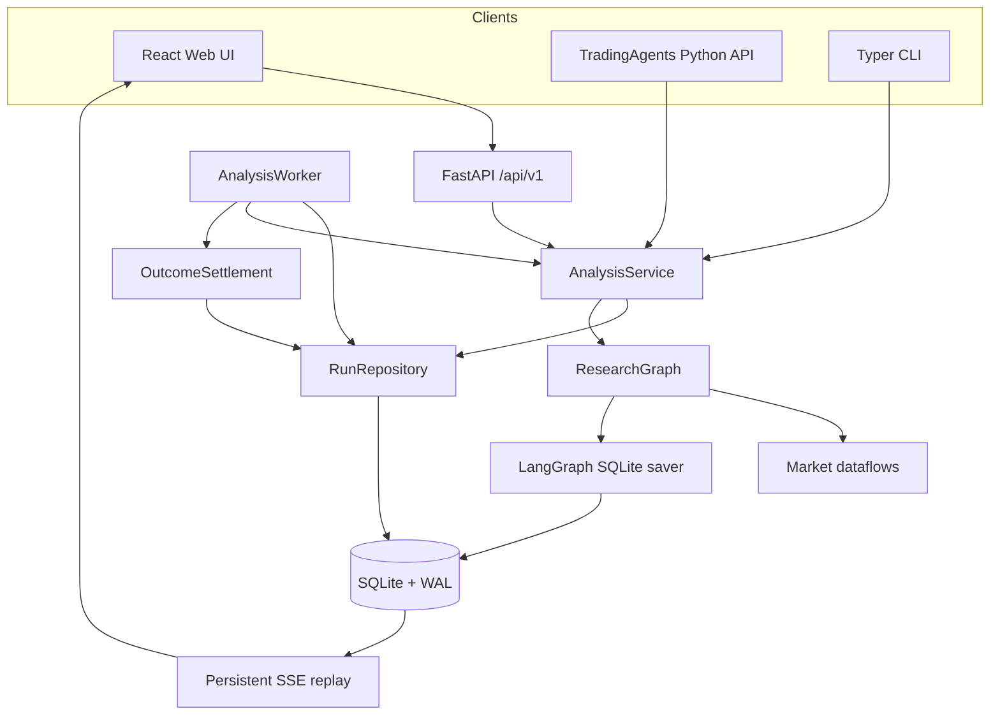
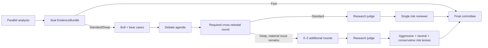

# TradingAgentsX Architecture

This document defines durable subsystem boundaries and correctness contracts.
Code and tests remain authoritative for exact schemas, limits, and provider
behavior. The product-line decision is recorded separately in
[ADR 0001](adr/0001-independent-product-line.md).

## Scope

TradingAgentsX is a local, single-user research system:

- one Web process and, by default, one analysis worker;
- one SQLite database on a local filesystem shared by those processes;
- US/default, Japanese, China A-share, and compatible crypto/FX data paths;
- research decisions, not accounts, holdings, cash, execution, or rebalancing;
- no multi-tenancy, collaboration, schedules, watchlists, or cross-host worker
  fleet in this architecture.

SQLite repositories and the LangGraph checkpointer may later be replaced by
PostgreSQL-backed implementations without changing public research contracts.
Redis is not part of the local architecture.

## System boundaries



### Public contracts

`tradingagents` exports:

- `TradingAgents`
- `AnalysisRequest`
- `AnalysisResult`
- `ResearchDecision`
- `RunProfile`

`TradingAgentsGraph` is not a public compatibility surface. Direct callers and
the CLI enter through `TradingAgents`/`AnalysisService`, which ensures that
persistence and lifecycle behavior cannot be bypassed accidentally.

`ResearchDecision` is intentionally account-free:

```text
rating
confidence
executive_summary
thesis
evidence_refs
memory_refs
catalysts
risks
invalidation_conditions
unresolved_questions
time_horizon
scenarios[base, bull, bear]
valuation_assessment
market_reference_levels
risk_review_adjustments
```

Non-personalized ratings, conditional investment views, auditable valuation
ranges, scenarios, and market reference levels are allowed. Position
percentage, account configuration, order quantity/type, broker instructions,
mandatory entry/stop/take-profit levels, guarantees, and personalized
execution fields do not belong in this contract.

### Settings and runtime context

`AppSettings` and `RunSettings` are immutable Pydantic models.
`AppSettings.from_env()` is called at an application entry point; dotenv files
are never loaded as a package-import side effect. Provider keys remain in the
process environment and are excluded from persisted configuration snapshots.

Every run resolves its own `RunSettings` and immutable `RunContext`. LangGraph
runtime context and `ToolRuntime` carry the request, analysis date, instrument
context, dataflow configuration, memory, cancellation callback, and event
writer. The dataflow `ContextVar` bridge exists only to support established
adapter signatures during one scoped invocation; there is no mutable package
configuration or `set_config()` operation.

Two runs with different provider, model, reasoning, language, or vendor
settings must remain isolated even if worker concurrency changes in the future.

## Application lifecycle

`AnalysisService` is the lifecycle owner. It:

1. normalizes and validates `AnalysisRequest`;
2. resolves and redacts run configuration;
3. creates or idempotently returns a run;
4. retrieves deterministic decision memory;
5. builds per-run LLM clients and `RunContext`;
6. executes or resumes the graph;
7. persists events, reports, evidence, decision, metrics, and warnings;
8. cleans up or retains checkpoints according to terminal state;
9. creates a pending outcome for background settlement.

Graph nodes return state; they do not write files, reports, or application
tables.

### Run state and attempts

```text
queued → running → succeeded
                 ↘ failed
                 ↘ cancelled
```

The worker atomically claims one queued run and sets a lease. A process crash
leaves the run recoverable after lease expiry. Heartbeats extend active leases.
`tradingagents start` is a local foreground supervisor that health-gates and
monitors the otherwise independent Web and worker processes; production-style
and Docker deployments continue to manage those processes separately. Its
merged output retains child colors and adds distinct service labels. The first
interrupt requests cooperative shutdown and waits up to 30 seconds; a second
interrupt forces termination.

- `retry` is valid for a failed run, increments its attempt, and reuses the
  compatible checkpoint thread.
- a terminal run can seed an editable New Run form; submitting it creates a
  linked run with a new ID and fresh data/evidence snapshot.
- a queued cancellation becomes terminal immediately;
- a running cancellation is checked cooperatively at graph-node boundaries;
- supervisor shutdown returns a running claim to the queue at the next node
  boundary without changing its attempt or deleting its checkpoint;
- an in-flight provider call is force-killed only after the supervisor grace
  period, after which lease expiry provides crash recovery.

Successful and cancelled runs delete their checkpoint thread. Failed runs keep
it for retry or later trash cleanup.

### Trash lifecycle

Only terminal runs can be moved to Trash. A trashed run remains readable and
exportable, but is excluded immediately from default run listings, Dashboard
summaries, Memory and `MemoryContext`, pending outcome settlement, and
recent-instrument suggestions. Restore is idempotent and re-enables those
consumers.

The Web process performs one opportunistic expiry check at startup. The worker
checks before its first claim and uses a monotonic in-process deadline for
subsequent checks: 24 hours after success or one hour after failure. UTC
database timestamps determine the configured retention boundary. Cleanup uses
bounded SQLite write transactions, rechecks that each candidate is still
trashed before deletion, removes its checkpoint and owned application rows,
and leaves `legacy_imports` hashes with a null run link. Concurrent Web/worker
checks are therefore idempotent. `TRADINGAGENTS_TRASH_RETENTION_DAYS=0`
disables permanent cleanup.

`runs.instrument_name` stores the identity resolver's preferred display value
(`short_name`, then `company_name`, `long_name`, or `name`). Resolution failure
does not fail research. The recent-instruments API deduplicates non-trashed
runs by ticker and never derives names from LLM output.

### Database

Alembic manages application tables:

| Table | Responsibility |
| --- | --- |
| `runs` | request, redacted settings snapshot, status, lease, error, metrics |
| `run_attempts` | attempt state, checkpoint thread, lease and resume count |
| `run_events` | per-run monotonic sequence, attempt, node, sanitized payload |
| `reports` | Markdown narrative and structured analyst payload |
| `decisions` | typed decision, evidence bundle, market identity |
| `outcomes` | benchmark, five-interval dates, raw return, alpha |
| `reflections` | outcome-aware research reflection |
| `legacy_imports` | source/hash/status for idempotent Markdown migration |

LangGraph saver tables live in the same database file but remain owned by its
saver. Application code does not treat them as domain tables.

Every SQLite connection enables foreign keys, WAL, a bounded busy timeout, and
normal synchronous mode. WAL still permits only one writer at a time. The
database and `-wal`/`-shm` files must be on one host-local filesystem; NFS/SMB
deployment is unsupported.

`tradingagents db backup` uses SQLite's online backup operation and is the
supported backup boundary.

### Events and SSE

Events are sanitized and committed before an in-process callback or SSE client
can observe them. `run_events.sequence` is unique and monotonically increasing
within a run.

`GET /api/v1/runs/{id}/events`:

1. takes the greater of `after` and `Last-Event-ID`;
2. replays committed events after that sequence;
3. polls for new events and emits periodic keepalives;
4. closes after the run reaches a terminal state.

Browser refresh therefore does not lose progress. SSE is one-way by design;
run mutations use ordinary HTTP endpoints.

## Evidence-first research graph

### Independent analyst channels

Market, Social/Sentiment, News, and Fundamentals analysts begin in the same
LangGraph superstep but use independent local message state and tools. Tool
collection is followed by evidence preparation, Markdown report writing, and a
small audit-extraction step. The durable `AnalystReport` handoff is:

```text
analyst
markdown
report_sections[{id, title, anchor, source_refs}]
confidence
key_claims[{id, section_id, kind, importance, statement, implication,
            confidence, evidence_refs}]
source_refs
audit_status: complete | incomplete
warnings
```

Markdown is the formal human-readable report. It may contain headings, lists,
and GFM tables, and is not reconstructed from typed rows or cells. A
non-thinking serializer extracts only the small navigation and claim audit
envelope. If that extraction still fails after one bounded repair, the Markdown
report is preserved with `audit_status=incomplete` and the graph continues. A
missing or truncated report body still fails the analyst node.

### Evidence sealing

Each `EvidenceItem` records:

```text
ref
source
evidence_type
requested_date
effective_date
available_at
content or value
unit
quality
fallback
provenance
```

`EvidenceBundle(version="5")` deduplicates items, validates unique references,
rejects effective dates after the analysis cutoff, interprets `available_at`
in the instrument's market timezone, and seals both evidence items and
deterministic raw `EvidenceTable` objects with a digest.

The sealed bundle is written to `run_evidence` independently of the run's final
status. Evidence sealing and its `evidence.sealed` event commit atomically, so a
running or failed run can still expose the immutable ledger. Analyst artifacts,
deliberation artifacts, and the final decision are also durable as soon as each
stage completes; Run Detail and exports therefore show partial research rather
than treating an unsuccessful attempt as empty.

`EvidenceTable` is an audit fact table containing canonical raw values and
source mappings. It is available on the Evidence page and as CSV in the
research package, but is never copied wholesale into a model prompt or forced
into a user report. Analysts receive a compact catalog, deterministic
analytical views, and a bounded role-specific workset. Read-only local lookups
operate on the sealed artifacts without recontacting the provider.

### Markdown-first deliberation

Post-analyst roles consume the complete Analyst Markdown, available key claims,
the Evidence catalog, and a deduplicated role-specific lookup workset. The full
raw EvidenceBundle is not broadcast to every role.

Visible research-process artifacts have separate contracts:

```text
ResearchCase       role Markdown plus focused claim and report-section IDs
DebateAgenda       short summary plus prioritized issue IDs and questions
RebuttalReview     role Markdown plus addressed and open issue IDs
JudgeDraft         judge Markdown, preliminary rating, and issue dispositions
RiskReview         role Markdown plus challenged and unresolved issue IDs
ResearchDecision   strict final opinion, scenarios, calculations, and evidence
```

Cases, agenda, rebuttals, judge, and risk reviews use a reasoning-model Markdown
write followed by a non-thinking shallow audit. Graph routing depends on stable
claim/issue IDs and dispositions, not on parsing prose. The Final Committee
uses a reasoning pass to form the synthesis brief and a separate strict
serializer for `ResearchDecision`. Only decision-critical valuation, scenario,
or market-reference arithmetic uses `CalculationRecord`.

Every artifact records its prompt version and structured generation method. No
artifact stores hidden reasoning traces or raw provider conversations.

Adapters may still encode transport provenance in versioned markers. Analyst
nodes extract those markers from tool messages into typed evidence and remove
the control syntax from human narrative. Prose is never the canonical
provenance transport between graph stages.

### Profiles



- **Fast:** no debate; the committee directly synthesizes analyst reports.
- **Standard:** parallel bull/bear cases, a debate agenda, one required
  cross-rebuttal round, a judge draft, one integrated risk review, then a final
  committee.
- **Deep:** parallel bull/bear cases, a debate agenda, one required and at most
  two additional targeted rebuttal rounds, a judge draft, three parallel risk
  lenses, then a final committee.

Fast final synthesis and Standard judge/final synthesis use the deep model.
Other Standard deliberation roles use the quick model. Deep uses the deep
model for every case, agenda, rebuttal, judge, risk, and final role; analyst
tool collection and report synthesis continue to use the quick model.

Deep always executes its first targeted rebuttal. A later round requires a
materially open agenda issue plus new evidence, a new causal mechanism, or a
specific claim rejection; repeated thesis prose does not keep the loop alive.
Role nodes are produced from `RoleSpec`; separate persona modules do not
duplicate state copying and prompt assembly. There is no Trader node.

### Observable execution phases

Metrics and events use stable phase suffixes. They describe execution
responsibility rather than separate public graph nodes:

| Phase | Meaning |
| --- | --- |
| `collect` (or the base `analyst.<role>` node) | Deterministic data/tool collection; normally no LLM call |
| `prepare` | Reasoning-model evidence blueprint plus a validated, batched local lookup plan |
| `report`, `write`, `reason` | Reasoning-model report, deliberation Markdown, or final synthesis brief |
| `audit` | Non-thinking extraction of a small report/deliberation audit envelope |
| `serialize` | Non-thinking mapping of the final synthesis to the strict decision contract |

Per-phase wall time surrounds the actual operation, so LLM calls, tool calls,
tokens, and elapsed time belong to the same phase. Run Detail orders these rows
by their first persisted timeline event, not by duration.

## Decision memory and outcomes

The repository supplies deterministic context:

- up to five most recent resolved full entries for the same ticker;
- up to three most recent resolved reflection-only entries for a different
  ticker in the same asset type and regional market;
- pending outcomes and legacy outcomes shorter than five intervals are excluded.

No vector database is used. This avoids introducing an unmeasured semantic
similarity feedback loop.

Outcome settlement is a low-priority worker task, independent of a future run
for the same ticker. Ticker and benchmark histories retain their own
exchange-local date labels and are intersected by date. Six common completed
closes form five intervals:

```text
raw return = ticker_close[5] / ticker_close[0] - 1
alpha      = raw return - (benchmark_close[5] / benchmark_close[0] - 1)
```

Each pending outcome stores its next due time. The initial check is no earlier
than the market-local day after six plausible closes (daily for crypto,
weekdays as the lower bound for other markets). An incomplete observation is
deferred for 24 hours; a provider or transport failure is retried after one
hour. Exchange holidays therefore degrade to bounded daily checks instead of
the worker poll interval.

The stored range and reflection describe short-term feedback. They are not the
sole truth for long-horizon thesis validity or graph quality.

## Data routing and point-in-time contracts

### Symbols and market dates

`normalize_symbol` converts supported aliases to canonical
Yahoo-compatible symbols before routing. It covers broker aliases, common
forex/crypto forms, bare A-share codes, and `CODE.SH` → `CODE.SS`.
Ambiguous or unsupported mainland symbols fail loudly.

The analysis cutoff uses the instrument market's timezone, never the host's
calendar or an unconditional UTC date. Historical tools receive that cutoff
from runtime context rather than an LLM-provided argument.

Sources truncate observations to the cutoff. A disclosure/update source uses
the conservative visibility boundary. Live-only values are withheld from
historical runs; absence remains unknown rather than becoming a neutral or
bearish signal.

### Vendor chains and assemblers

Configuration resolution remains:

1. `tool_vendors[method]`
2. `data_vendors_by_market[suffix][category]`
3. `data_vendors[category]`

A comma-separated value is an exact ordered fallback chain. The router never
adds an unconfigured vendor. First-success routing and multi-source composition
are different operations: an assembler owns composition, fault isolation,
deduplication, and final caps.

| Market | Prices/indicators | Fundamentals/statements | Ticker news |
| --- | --- | --- | --- |
| US/default | yfinance | yfinance | yfinance |
| Japan `.T` | J-Quants → yfinance | JP assemblers → J-Quants → yfinance | EDINET + TDnet + Google News → yfinance |
| China `.SS`/`.SZ` | Tencent qfq → Eastmoney qfq → yfinance | CNINFO + Sina → yfinance | CNINFO + Eastmoney Research + Google News → yfinance |

Ticker-less global news, macro, and prediction markets stay market-agnostic.
Macro panel cells fail independently and retain actual-source/fallback
provenance.

### Failures and quality

Adapters use the typed vendor failure taxonomy. Missing configuration,
rate-limit, transport, schema, stale, and valid-empty outcomes remain
distinguishable. Retries, timeouts, caches, and HTTP behavior stay local to an
adapter or its subsystem utility.

Material fallback, missing/partial coverage, truncation, staleness, and
non-PIT/non-vintage limitations become typed warnings. A successful empty news
window is not itself a warning.

## Security boundary

The normal server binds to loopback and needs no login. LAN mode requires one
environment token; the login endpoint exchanges it for a signed, expiring,
`HttpOnly`, `SameSite=Strict` cookie. Mutating requests validate same origin.

Provider keys, authorization headers, LAN tokens, session secrets, raw provider
exceptions, and sensitive tool arguments must not be stored in application
tables, events, SSE, API errors, or browser logs. Settings/capability endpoints
expose only whether a key is configured.

This is a single-user local boundary. It does not provide TLS, user accounts,
roles, tenant isolation, or Internet-facing hardening.

## Validation boundaries

The default suite is offline. It covers configuration isolation, lifecycle
transitions, lease recovery, event ordering, checkpoint resume/cleanup,
SSE replay, cancellation/retry/run templates, SQLite backup, migration, memory
selection, point-in-time evidence sealing, API security, frontend behavior,
wheel contents, and Docker startup.

Fixed US/JP/CN/crypto fixtures test graph output contracts. Model performance
release gates require recorded same-model executions and are documented in
[graph-evaluation.md](graph-evaluation.md); offline fixture success must not be
reported as measured model quality, latency, or token improvement.

## Implementation map

- Public API: `tradingagents/client.py`,
  `tradingagents/application/contracts.py`
- Lifecycle: `tradingagents/application/service.py`
- Worker/outcomes: `tradingagents/application/worker.py`,
  `tradingagents/application/outcomes.py`
- Repository/schema: `tradingagents/application/repository.py`,
  `tradingagents/application/database.py`
- Migrations: `tradingagents/persistence/`
- Graph: `tradingagents/graph/research_graph.py`
- Agent tools: `tradingagents/agents/utils/`
- HTTP/security: `tradingagents/web/`
- React application: `frontend/`
- Routing: `tradingagents/dataflows/interface.py`
- Japan/China: `tradingagents/dataflows/jp/`,
  `tradingagents/dataflows/cn/`
- Evaluation contracts: `tradingagents/evals/`, `evals/fixtures/`
