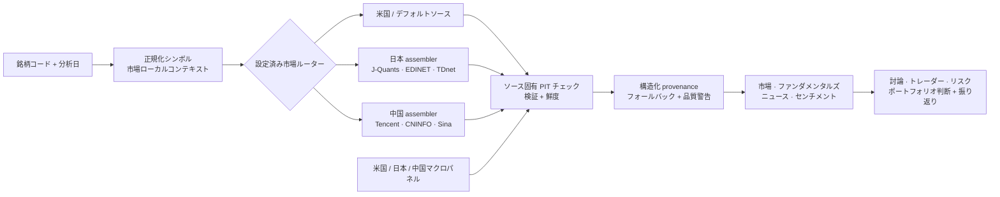

# TradingAgentsX

<div align="center">

[English](../../README.md) · [简体中文](README.zh-CN.md) · **日本語**

</div>

<div align="center" style="line-height: 1;">
  <a href="https://arxiv.org/abs/2412.20138" target="_blank"></a>
  
</div>

TradingAgentsX は TradingAgents のエージェントグラフ上に構築された、
マルチエージェント LLM 金融リサーチフレームワークです。米国・デフォルトルートに
加えて、日本株（`.T`）と上海・深圳 A 株（`.SS`/`.SZ`）の専用データフローを
提供します。市場ごとのソースと assembler を共通ワークフローへ供給し、分析日の
境界、出典、監査可能なフォールバックを明示します。

> **フォークについて。** 本プロジェクトは
> [TauricResearch/TradingAgents](https://github.com/TauricResearch/TradingAgents)
> の独立管理フォーク（Apache-2.0）です。`0.3.1` までのリリース履歴は上流から
> 継承し、`0.4.0` 以降は TradingAgentsX が独自のリリースとバージョン系列を
> 管理します。上流の変更を選択的に取り込むことはありますが、上流のバージョン番号が
> 本プロジェクトの番号を決めることはありません。上流への帰属とライセンス情報は
> [LICENSE](../../LICENSE)、[NOTICE](../../NOTICE)、および
> [変更履歴](../../CHANGELOG.md) に保持されています。

<div align="center">

[追加機能](#tradingagentsx-が追加するもの) · [概要](#概要) ·
[対応市場](#対応市場) · [インストール](#インストール) ·
[CLI](#cli-の使い方) · [日本市場](#日本市場) · [中国-a-株](#中国-a-株) ·
[Python API](#python-api) · [開発](#開発) ·
[アーキテクチャ](../architecture.md) · [変更履歴](../../CHANGELOG.md)

</div>

## TradingAgentsX が追加するもの

- **単なるシンボル接尾辞対応ではない、地域専用データシステム。** 日本株と
  中国 A 株の adapter / assembler が、現地ソースから市場、ファンダメンタルズ、
  ニュース、センチメント、開示、ポジショニング、マクロの根拠を供給します。
- **データフローに組み込まれた point-in-time 整合性。** ワークフローが分析日を
  注入し、adapter がソースの可視日と市場ローカルのカレンダー境界を適用します。
  現在時点専用のフォールバックを過去分析に正当化できない場合は fail closed します。
- **監査可能な根拠。** 要求日、有効日、実際に選ばれたソース、フォールバック状態、
  重要な制約を構造化 provenance として保持し、`Data Quality Warnings` に表示します。
- **地域横断マクロコンテキスト。** 米国、日本、中国の指標を障害分離された 1 つの
  パネルへ集約し、プロバイダー 1 つの欠損が無関係なセルを消さないようにします。
- **独立した実行制御と継続性。** Quick/deep モデルロールの reasoning を個別設定でき、
  CLI と Python 実行は上限付き・市場分離された振り返りログと、任意のチェックポイント
  復旧を共有します。
- **リリース品質の検証。** CI は Python 3.10–3.13、リポジトリ全体の lint、
  クリーンインストール smoke を実行します。任意の live contract は市場横断 schema、
  完了取引日のカットオフ、実ソース、フォールバックを検証します。

### データフロー概要



この図は意図的に高レベルの概要に限定しています。正確なルーティング優先順位、
assembler の責務、キャッシュ、point-in-time 契約は
[アーキテクチャ文書](../architecture.md)を参照してください。

## 概要

TradingAgentsX は上流の投資チーム構成を維持します。市場、ファンダメンタルズ、
ニュース、センチメントの 4 種類のアナリストが根拠を用意し、強気・弱気の研究員が
議論し、トレーダーがポジションを提案します。最後にリスクチームとポートフォリオ
マネージャーが最終判断を行います。

```text
アナリスト → 強気/弱気討論 → リサーチマネージャー → トレーダー
           → リスク討論 → ポートフォリオマネージャー → 振り返り
```

<p align="center">
  
</p>

対話型 CLI と Python からの直接利用に対応しています。アナリストは個別に選択でき、
LLM プロバイダーも設定可能です。CLI と `TradingAgentsGraph.propagate()` の直接実行は、
実行間の振り返りログを共有し、任意の LangGraph チェックポイントから中断した分析を
再開できます。

> TradingAgentsX は金融リサーチフレームワークです。出力は金融、投資、売買の助言を
> 構成しません。結果はモデルの挙動、データ品質、時点、設定に依存します。

## 対応市場

内部では Yahoo 互換の正規化済みシンボルを使用します。対応する別名は市場ルーティング
の前に正規化され、たとえば `600519` は `600519.SS`、`000001` は
`000001.SZ`、`600519.SH` は `600519.SS` になります。未対応または曖昧な
中国本土の 6 桁コードは明示的にエラーとなり、誤って米国市場ルートへ流れません。

| 市場 | 例 | データフロー |
| --- | --- | --- |
| 米国/デフォルト | `NVDA`、`SPY` | yfinance ベースのデフォルトルート |
| 日本 | `7203.T` | J-Quants と日本の開示ソース、および設定済みフォールバック |
| 中国 A 株 | `600519.SS`、`000001.SZ` | Tencent/AkShare と、中国のファンダメンタルズ、ニュース、マクロソース |
| その他の Yahoo 市場 | `0700.HK`、`AZN.L`、`RELIANCE.NS` | Yahoo 互換のデフォルト動作。専用の現地市場データフローはなし |
| 暗号資産/FX | `BTC-USD`、`EURUSD=X` | Yahoo 互換のデフォルトルートと対応別名 |

中国市場の専用対応範囲は、現在、上海・深圳の個別 A 株です。北京 `.BJ`、香港
`.HK`、ETF、ファンド、オプション、中国市場の日中高頻度データは本フェーズの
対象外です。

### デフォルトのデータソースルーティング

矢印は順序付きフォールバック、括弧は複数ソースの組み合わせを表します。

| 市場 | 価格と指標 | ファンダメンタルズと財務諸表 | 個別銘柄ニュース |
| --- | --- | --- | --- |
| 米国/デフォルト | yfinance | yfinance | yfinance |
| 日本 `.T` | J-Quants → yfinance | 日本向け assembler → J-Quants → yfinance | (EDINET + TDnet + Google News) → yfinance |
| 中国 `.SS`/`.SZ` | Tencent qfq → Eastmoney qfq → yfinance | (CNINFO + Sina) → yfinance | (CNINFO + Eastmoney Research + Google News) → yfinance |

グローバルニュースアナリストには、地域横断のマクロパネルも提供されます。米国・
グローバルのセルは FRED、日本のセルは日本銀行、e-Stat、財務省、FRED、中国の
セルは国家統計局、Eastmoney、国家外貨管理局、および意図的に限定した ChinaMoney
フォールバックを使用します。あるソースが欠けても、そのソースが担当するセルだけが
無効になります。

ルーティング、キャッシュ、point-in-time、失敗時の契約については
[アーキテクチャ文書](../architecture.md)を参照してください。

### データ完全性と出典

- グラフ向けツールはワークフロー状態から分析日を受け取ります。過去時点の分析へ、
  現在時点専用のスナップショットを暗黙に混入させません。
- ベンダーチェーンは明示的です。ルーターが未設定のフォールバックを追加することはなく、
  複数ソースを意図的に統合する処理は assembler が担当します。
- 結果は構造化 provenance として、要求日、有効日、実際のソース、時点または
  フォールバック状態を保持します。
- 重要なフォールバック、古いデータ、欠損または部分的なカバレッジ、切り捨て、
  non-PIT/non-vintage の制約は `Data Quality Warnings` に表示されます。
  ニュースウィンドウが正常に空だった場合は警告しません。
- `provenance_appendix = True` または
  `TRADINGAGENTS_PROVENANCE_APPENDIX=true` を設定すると、詳細な英語の
  `Data Provenance` 表を追加します。この表を無効にしても重要な警告は表示されます。

## インストール

Python 3.10 以降が必要です。

```bash
git clone https://github.com/qingchiang/trading-agents-x.git
cd trading-agents-x

python -m venv .venv
source .venv/bin/activate
pip install .
```

開発時は `dev` extra をインストールしてください。

```bash
pip install -e ".[dev]"
```

### Docker

```bash
cp .env.example .env  # 使用するキーを追加
docker compose run --rm tradingagents
```

同梱の Ollama サービスを利用する場合：

```bash
docker compose --profile ollama run --rm tradingagents-ollama
```

## 設定

環境変数テンプレートをコピーし、LLM プロバイダーを 1 つ設定します。

```bash
cp .env.example .env
```

OpenAI、Anthropic、Google、Azure OpenAI、Amazon Bedrock にはネイティブクライアントが
あります。OpenAI 互換レジストリは xAI、DeepSeek、Qwen、GLM、MiniMax、
OpenRouter、Mistral、Kimi、Groq、NVIDIA NIM、Ollama、および vLLM や
LM Studio など任意の互換エンドポイントに対応します。プロバイダー別の変数は
[.env.example](../../.env.example)を参照してください。

Amazon Bedrock には `pip install ".[bedrock]"` が必要です。Azure ユーザーは
`.env.enterprise.example` から設定を開始できます。Ollama のデフォルトは
`http://localhost:11434/v1` で、`OLLAMA_BASE_URL` により変更できます。

主な例：

```dotenv
OPENAI_API_KEY=...
ANTHROPIC_API_KEY=...
GOOGLE_API_KEY=...
DEEPSEEK_API_KEY=...
OPENROUTER_API_KEY=...
```

任意の互換エンドポイントでは、`llm_provider = "openai_compatible"` とし、
`backend_url`（または `TRADINGAGENTS_LLM_BACKEND_URL`）を設定します。
`OPENAI_COMPATIBLE_API_KEY` はエンドポイントが認証を要求する場合にだけ指定します。

### 任意の市場データキー

中国市場の初期データフローはキー不要です。日本の各ソースは独立して縮退するため、
次のキーはいずれも必須ではありません。

```dotenv
JQUANTS_API_KEY=...  # 価格、サマリー、プラン依存のポジショニングデータ
EDINET_API_KEY=...   # 法定開示、保有状況、公開買付け
ESTAT_APP_ID=...     # 日本 CPI 系列
FRED_API_KEY=...     # 米国/グローバルマクロと一部の日本向けフォールバック系列
```

## CLI の使い方

```bash
tradingagents
# または
python -m cli.main
```

CLI では、銘柄、分析日、アナリスト、調査深度、LLM プロバイダーを選択できます。
CLI と Python グラフは同じ正規化済みシンボルと市場ルートを使用します。

<p align="center">
  
</p>

## 日本市場

東京市場の銘柄では、Yahoo の比較的薄い英語圏カバレッジだけに依存せず、4 種類の
アナリストすべてが現地ソースを利用します。

| 分野 | 主な根拠 |
| --- | --- |
| 市場/テクニカル | J-Quants v2 の調整済み日足と検証済みスナップショット |
| ファンダメンタルズ | J-Quants サマリー、開示時点に安全な比率、TOPIX 週次 beta、選別済みの直近財務明細 |
| ニュース | EDINET 書類、TDnet 適時開示、Google News Japan、ラベル付き市場区分コンテキスト |
| センチメント | 銘柄別信用・空売りデータ、EDINET 大量保有・公開買付け書類、ライブ専用レーティング |
| マクロ | 日銀政策金利/Tankan、e-Stat CPI、財務省の日次国債利回り、FRED フォールバック |

J-Quants Light は価格、サマリー、市場区分別フローをカバーします。Standard では
銘柄別の信用・空売りポジションシグナルも利用でき、Premium は不要です。J-Quants
キーがない場合、価格と直近ファンダメンタルズは yfinance にフォールバックできます。
フォールバック先に提出時刻がない過去財務諸表は fail closed となります。EDINET が
なくても、ほかのニュースソースは独立して継続します。

日本の履歴データフローは、利用可能な場合に公表日の境界を適用します。当日の EDINET
一覧は短期キャッシュ、確定済み書類一覧は上限付きディスクキャッシュを使います。
財務省の利回りデータは、翌営業日 09:30 JST の公表境界を過ぎてから分析へ入ります。

## 中国 A 株

現在の中国市場対応は、上海・深圳の個別株を対象とする低頻度分析です。

| 分野 | 主な根拠 |
| --- | --- |
| 市場/テクニカル | Tencent の前方調整（`qfq`）OHLCV。Eastmoney、yfinance の順にフォールバック |
| ファンダメンタルズ | CNINFO 企業プロフィールと、公表日でフィルタした Sina 財務サマリー・諸表 |
| ニュース | コード完全一致の CNINFO 公告、Eastmoney リサーチ、中国語 Google News |
| センチメント | 上海・深圳取引所の信用取引、持株変動、レーティング/目標株価、重要公告 |
| マクロ | 1 年 LPR、中国 10 年国債、CPI、GDP、失業率、製造業 PMI、USD/CNY 基準値 |

価格、検証済みスナップショット、指標は同じ qfq 履歴を共有します。通常のテクニカル
ウォームアップは上限付きの Tencent リクエスト 1 回に収まり、より長い履歴が必要な
場合だけページングします。プロバイダー間で調整係数が異なる可能性があるため、
フォールバック時は要求ウィンドウ全体を置き換えます。

企業情報はソース別に組み立て、それぞれの provenance を保持します。信頼できる公開
時点メタデータがない履歴データは fail closed とするか、non-PIT と明示します。
低頻度の CNINFO と Eastmoney の候補データは、銘柄と分析締切を厳密に分離した上限付き
キャッシュを共有し、ニュースとセンチメントが分析日の境界を越えずに再利用できます。

中国マクロの時点意味論はソースごとに異なります。国家統計局のリリースは公表日と観測
期間を保持し、GDP は年初来累計の前年比です。CPI、GDP、PMI は、条件を満たす直近の
国家統計局リリースがない場合に限り、観測期間でフィルタした Eastmoney 系列へ
フォールバックし、non-vintage と明示します。USD/CNY 基準値は国家外貨管理局を主ソース
とします。ChinaMoney は最新イールドカーブのスナップショットに限定し、履歴クローラー
には拡張しません。

AkShare とキー不要の中国向け assembler は公開 Web エンドポイントに依存します。
schema、ページング、bot 対策は予告なく変わる可能性があります。本番利用では HTTP
成功を鮮度の証明とみなさず、有効日、実際のソース、品質警告を監視してください。

## Python API

```python
from tradingagents.default_config import DEFAULT_CONFIG
from tradingagents.graph.trading_graph import TradingAgentsGraph

config = DEFAULT_CONFIG.copy()
config["llm_provider"] = "openai"
config["quick_think_llm"] = "gpt-5.4-mini"
config["deep_think_llm"] = "gpt-5.5"
config["quick_reasoning_effort"] = "low"
config["deep_reasoning_effort"] = "high"

graph = TradingAgentsGraph(debug=True, config=config)
final_state, decision = graph.propagate("600519", "2026-07-17")
print(decision)
```

`propagate()` は `(final_state, decision)` を返します。全設定項目は
[`tradingagents/default_config.py`](../../tradingagents/default_config.py)を
参照してください。

### ロール別の推論強度

`quick_reasoning_effort` と `deep_reasoning_effort` は 2 つのモデルロールを
個別に設定します。対応する環境変数は次のとおりです。

```dotenv
TRADINGAGENTS_QUICK_REASONING_EFFORT=low
TRADINGAGENTS_DEEP_REASONING_EFFORT=high
```

ロール固有値は従来のプロバイダー全体設定より優先されます。`provider_default` を
指定するとネイティブ SDK パラメーターを省略し、従来設定へのフォールバックも止めます。
対応レベルはプロバイダーとモデルにより異なり、選定済み候補については CLI カタログが
正となります。

## 永続化と復旧

正常終了した CLI と `TradingAgentsGraph.propagate()` の実行は、判断を
`~/.tradingagents/memory/trading_memory.md` に追記します。CLI レポートを保存する
必要はありません。同じ銘柄の後続の新規実行では、実現した素のリターンとベンチマーク
相対リターンを比較し、ポートフォリオマネージャーのコンテキストへ短い振り返りを
挿入できます。パスは `TRADINGAGENTS_MEMORY_LOG_PATH` で変更できます。

pending の結果には、固定された 5 取引セッションの観測期間を使用します。決済には、
銘柄と地域ベンチマークに共通する完了済み終値が 6 点揃うまで待ちます。第 1 点を開始、
第 6 点を終了として、5 つの整合した取引間隔を形成します。銘柄とベンチマークそれぞれ
の市場現地日付における当日データは除外されるため、休日の違いや欠損セッションがあれば
期間を短縮せず決済を延期します。振り返りは `TRADINGAGENTS_OUTPUT_LANGUAGE` に従い、
5 日間の短期的な市場フィードバックだけを表します。中長期の投資仮説が証明または否定
されたとは判断しません。また、`[2026-01-05 → 2026-01-12 | 5d]` のような
言語に依存しない接頭辞で実際の観測日を確実に保存し、モデルが本文で日付を繰り返すか
どうかには依存しません。

共有メモリーファイルは、解決済みレコードをデフォルトで最大 1,000 件保持します。
このグローバル上限を超えると、ファイル順で最も古い解決済みレコードから削除されます。
pending レコードは上限に数えず、削除もしません。
`TRADINGAGENTS_MEMORY_LOG_MAX_ENTRIES=0` を指定すると、解決済みレコードの件数上限を
無効にできます。Python 設定では `0` と `None` のどちらも上限なしを表します。

新しい分析では、同じ ticker の直近 5 件を判断と振り返りを含む完全な記憶として
挿入します。さらにデフォルトでは、資産タイプと地域市場の両方が一致する別 ticker
から、直近 3 件の振り返りだけを挿入します。たとえば上海・深圳の A 株は同じ市場に
属しますが、中国・日本・米国の市場間では共有しません。件数は
`TRADINGAGENTS_MEMORY_CROSS_TICKER_LIMIT` で変更でき、`0` にすると ticker 間の
記憶を無効にできます。

解決済みレコードは、保存された保有期間が `5d` 以上の場合に限りコンテキストへ
挿入できます。従来の `1d`～`4d` レコード、および保有期間が欠落しているか形式が
不正なレコードは Markdown ファイルにそのまま残りますが、同一 ticker と ticker 間
のどちらの記憶にも挿入されません。

チェックポイント機能はデフォルトで無効です。次のオプションはいずれもルートコマンドに
指定します。

```bash
tradingagents --checkpoint
tradingagents --no-checkpoint
tradingagents --clear-checkpoints
```

- `--checkpoint` と `--no-checkpoint` のどちらも指定しない場合は、
  `TRADINGAGENTS_CHECKPOINT_ENABLED` の設定に従います。この環境変数も未設定なら
  無効です。
- `--checkpoint` はチェックポイントを強制的に有効化し、`--no-checkpoint` は
  強制的に無効化します。どちらも環境変数より優先されます。
- `--clear-checkpoints` は質問開始前にすべてのチェックポイントデータベースを
  削除しますが、それ自体はチェックポイントを有効化しません。この実行で有効に
  するかどうかは、前述の規則で決まります。

チェックポイントが有効な場合、条件の一致する保存済み実行があれば CLI はその状態から
自動的に再開します。該当する保存状態がなければ最初から分析を始め、各ノードの完了後に
新しいチェックポイントを保存します。一致条件は、正規化済み銘柄、分析日、アナリスト
選択、討論深度、リスク深度、資産タイプです。いずれかが異なる場合は新規実行になります。

一致するチェックポイントは通常、チェックポイントを有効にした前回の実行が正常終了前に
中断され、かつ中断前に少なくとも一つの状態が SQLite へ書き込まれていた場合に残ります。
正常終了した実行は判断を追記し、対応する checkpoint thread を削除するため、完了済みの
分析が次回に再開されることはありません。

Python から直接利用する場合は、グラフ設定で `checkpoint_enabled=True` を指定します。
銘柄別 SQLite チェックポイントは
`~/.tradingagents/cache/checkpoints/` に保存され、
ベースディレクトリは `TRADINGAGENTS_CACHE_DIR` で変更できます。

## 再現性

LLM サンプリングとライブデータのため、再実行をバイト単位で同一にすることは困難です。
過去時点の実行ではライブ専用のソーシャル、企業同定、財務スナップショットを除外し、
大きなドリフト要因の一つを抑えます。取得済み payload が同じであれば、厳密な企業同定、
正規化済みシンボル、検証済み市場スナップショット、出典、日付締切は決定的です。

`temperature` を下げる効果があるのは、その設定を尊重するモデルだけです。推論モデルは
対応しないことが多いため、本フレームワークは固定的で再現可能な収益を持つ戦略ではなく、
リサーチの足場として扱ってください。

## 開発

デフォルトテストはプロジェクトの dotenv 読み込みを無効にし、実キーをプレースホルダーへ
置き換え、すべてのライブネットワーク契約をスキップします。

```bash
PYTHON_DOTENV_DISABLED=1 uv run --extra dev pytest -q
PYTHON_DOTENV_DISABLED=1 uv run --extra dev ruff check .
```

市場横断ライブデータ契約はオプトインで、直列実行します。

```bash
RUN_LIVE_DATA_TESTS=1 PYTHON_DOTENV_DISABLED=1 \
  uv run --extra dev pytest -q -m live_data
```

ライブスイートは schema、完了日締切、広い妥当値範囲、実際のソース、監査可能な
フォールバックを検証し、正確な価格や行数は固定しません。デフォルトの pytest と CI は
これらを収集しますがスキップします。

DeepSeek の wire-level 統合テストは別途オプトインです。

```bash
RUN_LIVE_LLM_TESTS=1 DEEPSEEK_API_KEY=... \
  uv run --extra dev pytest -q tests/test_deepseek_reasoning.py -m integration
```

コントリビューションを歓迎します。共通開発ルールは [AGENTS.md](../../AGENTS.md)、
長期的な設計契約は[アーキテクチャ文書](../architecture.md)、リリース履歴は
[CHANGELOG.md](../../CHANGELOG.md)を参照してください。

## 引用

本フレームワークが研究を支援した場合は、元の TradingAgents 論文を引用してください。

```bibtex
@misc{xiao2025tradingagentsmultiagentsllmfinancial,
      title={TradingAgents: Multi-Agents LLM Financial Trading Framework},
      author={Yijia Xiao and Edward Sun and Di Luo and Wei Wang},
      year={2025},
      eprint={2412.20138},
      archivePrefix={arXiv},
      primaryClass={q-fin.TR},
      url={https://arxiv.org/abs/2412.20138},
}
```
